# **python实用知识**

## 封装函数与调用函数

### 封装函数

新建一个python文件，如common.py

在里面定义函数

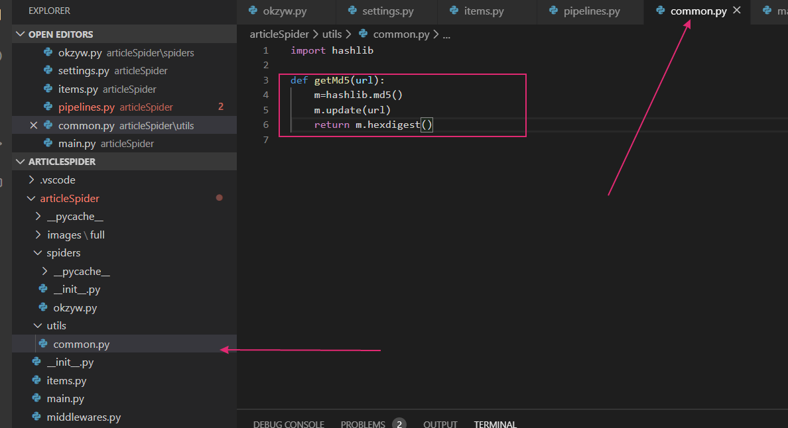{width="5.761805555555555in"
height="3.1333333333333333in"}

### **调用函数**

导入：

from 包名(从项目目录开始) import 函数名

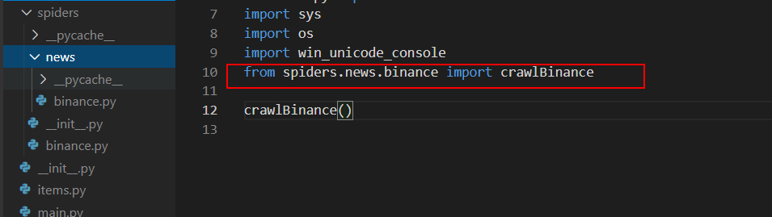{width="5.761805555555555in"
height="1.6229166666666666in"}

实用

函数名(参数)

## 类\|构造函数\|属性

class 类名(继承类) #没有继承类写上object父类

def \_\_init\_\_(self): #self相当于this

self.属性=\... #属性赋值

# python

面向对象，面向函数，与java的区别没有编译过程，只有解释过程，由c语言开发

主应用于操作系统管理， 服务器运维自动化脚本，服务器软件，科学计算器学习

安装

====环境

双击安装Anaconda3-5.2.0-Windows-x86_64.exe 安装目录会隐藏

双基安装python-2.7.15.amd64.msi

====开发软件

1、eclipse插件安装

Help---\> eclipse marketplace---\> pydev(较慢)

插件包：加压拷贝到eclipse的dropins中，重启即可

2、pycharm安装

傻瓜式安装，创建新的项目的时候直接选择sdk

第一次使用

{width="5.768055555555556in"
height="4.333333333333333in"}

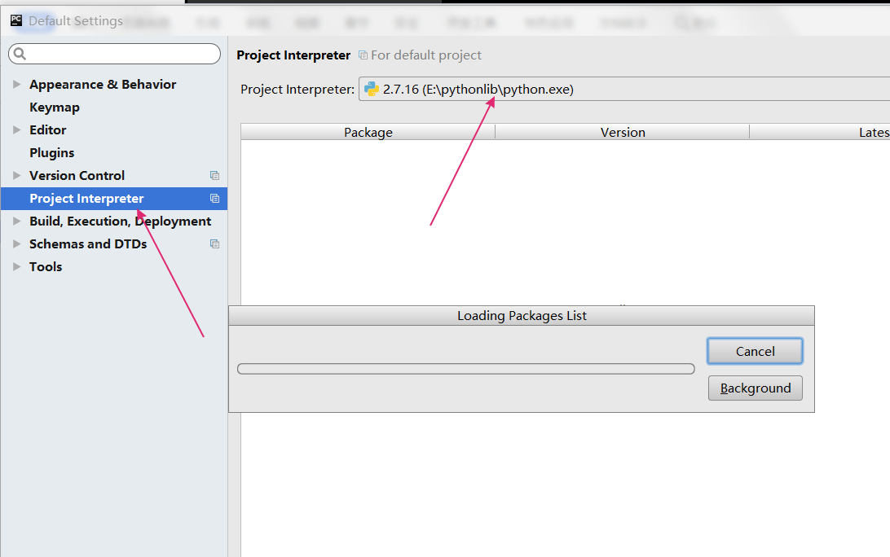{width="5.760416666666667in"
height="3.6083333333333334in"}{width="5.725in"
height="4.208333333333333in"}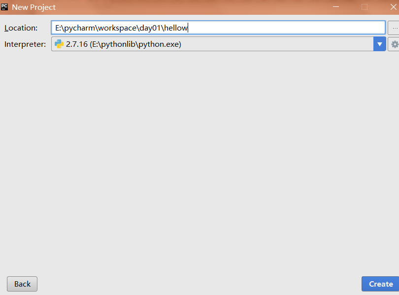{width="5.764583333333333in"
height="4.263194444444444in"}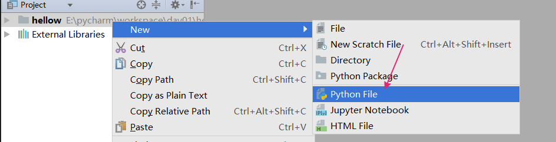{width="5.7659722222222225in"
height="1.4784722222222222in"}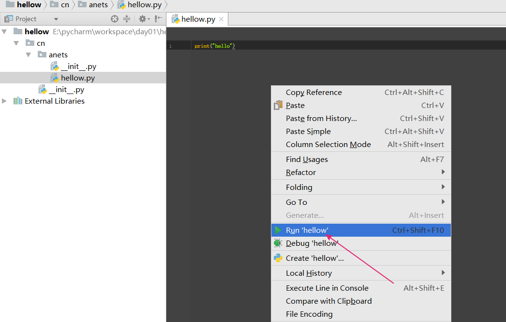{width="5.761805555555555in"
height="3.6798611111111112in"}

基础语法

### 注释

单行#

多行\... \...

### **中文乱码**

Python乱码问题

由于Python源代码也是一个文本文件，所以，当你的源代码中包含中文的时候，在保存源代码时，就需要务必指定保存为UTF-8编码。当Python解释器读取源代码时，为了让它按UTF-8编码读取，我们通常在文件开头写上这两行：

\# -\*- coding:utf-8 -\*-

或者# coding=utf-8

#### 自动注释

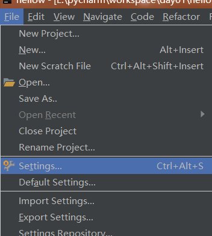{width="2.933333333333333in"
height="3.2666666666666666in"}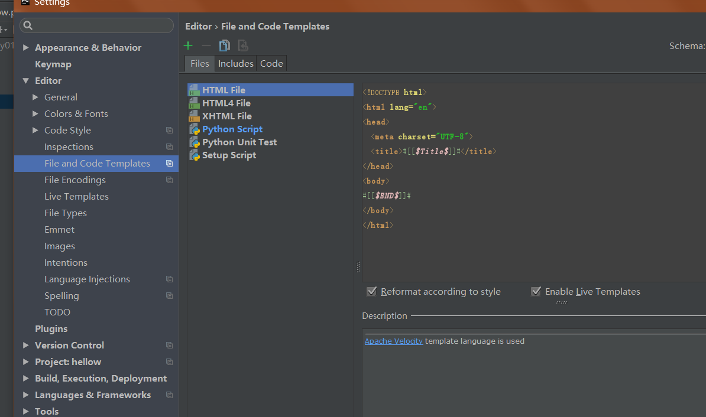{width="5.761111111111111in"
height="3.40625in"}

### 判断变量类型

print(type(变量))

### 输入和输出

#### 输入

a=input("提示")

输入字符串

a=raw_input("提示")

#### **输出**

常见的占位符有：

%d 整数

%f 浮点数

%s 字符串

%x 十六进制整数

i=10

j=11

print("%d%d=%d"%(i,j,j\*i))

print(data,end="\\t")以制表符结束，不用默认换行结束

### 运算符

/除

//整除

\*乘

\*\*求次方，幂

a,b=1,2

等同于

a=1

b=2

逻辑

and or not

比较\<\>

### 语句

#### if

if():

\...

elif():

\...

else:

\...

#### 循环

while():

\....

#输出\[1,10)，步长为2的自增长序列

for(i in range(1,10,2)):

\...

else:

\...循环完了执行，但不用

for in循环======================

for url in urls:

\....

### 字符串与列表

#### 字符串

字符串也有索引下标

str="sssss"

print str\[2\]

print str\[start:end:step\]
\[start,end)以step为步长输出，step为-1逆序输出

#### 字符串操作

##### 查询索引

index('..')

rindex('..')返回逆序第一个出现的位置

find('')

find()与index()区别在于find()找不到会返回-1，index()找不到会报错

##### 统计出现的次数

count('..',start,end)

返回字符或串出现的次数

##### 切割

split('分割字符',从头按照多少个分割字符分)

partition('') 以str分割成3部分，str前，str，str后

##### 字母大写

capitalize()首字母大写

title()每个单词首字母大写

##### 全大/小写

upper()

lower()

##### 对齐居中与填充just/center

ljust(长度,"填充字符") 左对齐

rust(长度,"填充字符")右对齐

center(长度) 按长度居中对齐

##### 字符串\*法

"#"\*3 结果 "###"

##### 格式操作\*strip()

lstrip() 左边空白符

strip()相当于trim()

##### 判断is\*()

isalpha() 所有字符都是字母，返回true

isdigit() 所有字符都是数字，返回true

isalnum()所有字符是数字或字母

isspace() 判断只包含空格

##### 字符串连接

字符串.join(\['a','b'\])

把字符串连接大a,b之间

#### 列表

数组列表\[a,b,c\]

#### 列表操作

##### 增加元素

append(a) 最后添加

insert(index,a)在index索引位置插入a

列表2.extend(list列表1) 把列表1添加到列表2

##### 修改元素

list\[index\]=新值

##### 删除元素

pop(index) 弹出指定位置元素

remove(a) 删除指定元素

del list\[index\]删除指定位置元素

##### 查找元素

index(a,start,end)

##### 统计元素次数

count(a)

##### 排序

sort()

注意list.sor()中list中数据类型要一致

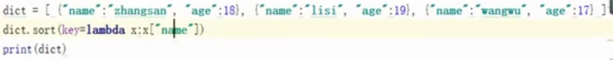{width="5.759722222222222in"
height="0.5673611111111111in"}

reverse() 翻转

### 元组tuples

元组合列表一样，不同在于元组的元素不能更改，元组使用()

只有一个元素时

t=(1,)加逗号消除歧义

### 字典dict

类似于map

dict={key:value,key:value}

取值：

dict\[key\]或者dict.get(key)

#### set不可重复无序集合\-\--特殊字典

只有key的dict

定义

set1={1,2,3}

set1=set(\[1,2,3\])

增加元素

set1.add(a);

#### 字典操作

dict.clear()清空

len(dict)长度

dict.keys()返回key列表

dict.values()返回value列表

dict.items()返回元组

#### 遍历

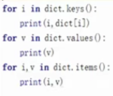{width="1.5833333333333333in"
height="1.3416666666666666in"}

### 函数

#### 定义

#def 函数名():

\...

1python函数没有重载重名的函数，后面会覆盖前面

2函数参数可以带默认值

3调用时可以带有（指定参数名=值）的形式，不是按照顺序

##### #不定长参数

\*arg（普通参数） \*\*kwargs(key=value型参数)

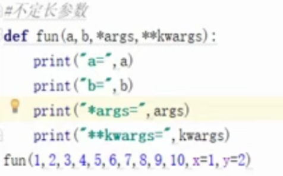{width="3.966666666666667in"
height="2.475in"}

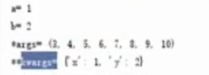{width="2.8583333333333334in"
height="1.0333333333333334in"}

##### #引用传参（重点）

可变类型与不可变类型的变量分别作为函数参数时，会有什么不同吗？

Python有没有类似C语言中的指针传参呢？

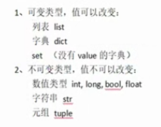{width="2.2916666666666665in"
height="1.8166666666666667in"}

\>\>\> def selfAdd(a):\... \"\"\"自增\"\"\"\... a += a

\...

\>\>\> a_int = 1

\>\>\> a_int 1

\>\>\> selfAdd(a_int)

\>\>\> a_int 1

\>\>\> a_list = \[1, 2\]

\>\>\> a_list \[1, 2\]

\>\>\> selfAdd(a_list)

\>\>\> a_list \[1, 2, 1, 2\]

Python中函数参数是引用传递（注意不是值传递）。对于不可变类型，因变量不能修改，所以运算不会影响到变量自身；而对于可变类型来说，函数体中的运算有可能会更改传入的参数变量。

##### #返回值

可以返回多个值

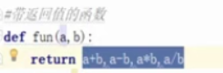{width="2.0416666666666665in"
height="0.675in"}

返回的是元组

相当于

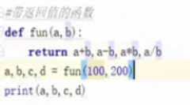{width="2.0in"
height="1.1083333333333334in"}

#### 全局变量与局部变量

全局变量在方法中可以使用但不能被改变

如果在函数中要改全局变量，需要加global，加global之后，函数中就不能出现同名局部变量

#### 匿名函数

a = lambda 参数1，参数2 :

\...

调用

a(实参1，实参2)

应用：

作为实参传入

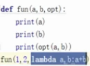{width="1.475in" height="1.075in"}

当作内置参数使用

{width="5.759722222222222in"
height="0.5673611111111111in"}

### python文件操作

#### 写文件

f=open('\...','w');

f.write('内容')

f.close()

#### 读文件

f=open('\...','r');

content=f.read(num) #num代表读取长度

f.close()

#cursor=f.tell() #指针位置

#读取多行readlines()

#读取一行readline()

#### 访问模式

w写(覆盖) a写(追加)

r读

x创建并写

b二进制模式

W+读写

#### 定位读写

f=open('\...','r');

content=f.seek(offset,mode)

f.close()

offset偏移量

mode 1:表示当前位置

0：表示文件开头

2 ：文件末尾

#### 文件相关操作

import os

os.name //判断使用的平台，window返回nt，linux返回posix

os.listdir()

os.getcwd() 获取当前工作目录

os.remove("\...")删除文件

os.mkdir("\...")

os.path.isfile('\...')判断是否是文件

os.path.isdir('\...')判断是否是目录

os.path.exists('\...')判断是否存在

os.path.split('\...')返回路径的目录名和文件名

os.system("命令") 命令输入

### 类和对象

1_init()\_完成对象的初始化操作，对象被创建完成后，立即调用执行，隐式调用

创建对象的参数要跟init方法的参数保持一致

2_new_是构造方法，创建对象时，首先调用的是new方法，new方法必须由返回值，参数必须跟创建对象传递的参数一致

3无论什么情况，init()和new()方法参数都要保持一致

class 类名(object):

def **\_init\_(self**,属性):

self.属性=属性 #当前对象初始化

self.\_\_属性=属性 #私有属性写法

def \_new\_(cls,属性)：

cls.属性=属性 #当前类初始化

return object.\_new\_(cls)

def 方法名(self){

\...

}

==调用

obj=类名()

obj.run()

obj.临时属性=a

特殊方法

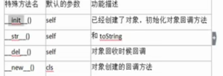{width="3.783333333333333in"
height="1.2916666666666667in"}

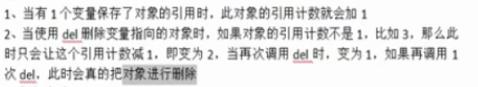{width="4.458333333333333in"
height="0.8166666666666667in"}

### 继承

class 类名(父类名1,父类名2):

def \_\_init\_\_(self,..):

**super().\_\_init(..) #调用父类的初始化方法**

父类名1.\_\_init()\_\_(self,..) #调用父类的初始化方法2

super(类名,self).\_\_init\_\_(\...) #调用父类的初始化方法3

### 多态

定义的类型和运行的类型不一样

Python "鸭子类型"

+-----------------------------------------------------------------------+
| class F1(object):                                                     |
|                                                                       |
| def show(self):                                                       |
|                                                                       |
| print\'F1.show\'                                                      |
|                                                                       |
| class S1(F1):                                                         |
|                                                                       |
| def show(self):                                                       |
|                                                                       |
| print\'S1.show\'                                                      |
|                                                                       |
| class S2(F1):                                                         |
|                                                                       |
| def show(self):                                                       |
|                                                                       |
| print\'S2.show\'                                                      |
|                                                                       |
| def Func(obj):                                                        |
|                                                                       |
| print obj.show()                                                      |
|                                                                       |
| s1_obj = S1()                                                         |
|                                                                       |
| Func(s1_obj)                                                          |
|                                                                       |
| s2_obj = S2()                                                         |
|                                                                       |
| Func(s2_obj)                                                          |
+-----------------------------------------------------------------------+

### 类属性和实例属性

类.属性 = a

可以直接修改类的属性值，但不能改私有的，不能调方法

### 类方法和静态方法

类方法

\@classmethd

def 类方法(cls):

return cls.属性

对象.类方法() 得到的结果是类的属性,类方法实例对象和类都可以访问

类.类方法

静态方法

\@staticmethd

def 类方法(): #静态方法不需要多定义参数

return 类.属性

2个没什么区别，只不过一个需要传参数，一个不需要，但常用第二种

### 设计模式

#### 单例模式

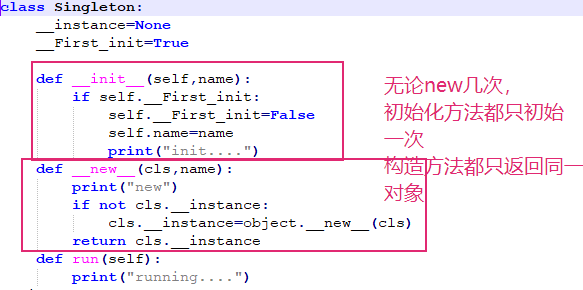{width="4.858333333333333in"
height="2.4166666666666665in"}

#### 工厂模式

工厂模式是我们最常用的实例化对象模式了，是用工厂方法代替new操作的一种模式。虽然这样做，可能多做一些工作，但会给你系统带来更大的可扩展性和尽量少的修改量(可维护性)。

1. 简单工厂模式

Simple Factory模式不是独立的设计模式，他是Factory
Method模式的一种简单的、特殊的实现。他也被称为静态工厂模式，通常创建者的创建方法被设计为static方便调用。

> 1、静态的工厂类
>
> 2、用全局函数改写工厂类
>
> 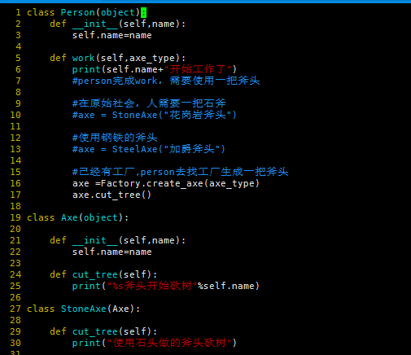{width="5.259027777777778in"
> height="4.541666666666667in"}
>
> 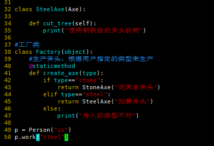{width="5.25in"
> height="3.0in"}

2. 工厂方法模式

> 工厂方法模式去掉了简单工厂模式中工厂方法的静态方法，使得它可以被子类继承。对于python来说，就是工厂类被具体工厂继承。这样在简单工厂模式里集中在工厂方法上的压力可以由工厂方法模式里不同的工厂子类来分担。

抽象的工厂类提供了一个创建对象的方法，也叫作工厂方法。

> 1\) 抽象工厂角色（Factory）：
> 这是工厂方法模式的核心，它与应用程序无关。是具体工厂角色必须实现的接口或者必须继承的父类。
>
> 2\)
> 具体工厂角色（Stone_Axe_Factory,Steel_Axe_Factory）：它含有和具体业务逻辑有关的代码。由应用程序调用以创建对应的具体产品的对象。
>
> 3\)
> 抽象产品角色(Axe)：它是具体产品继承的父类或者是实现的接口。在python中抽象产品一般为父类。
>
> 4\)
> 具体产品角色(Stone_Axe,Steel_Axe)：具体工厂角色所创建的对象就是此角色的实例。由一个具体类实现。

### 异常

try:

\...

except (异常类1，异常类2) as msg:

print msg

finally:

..

#### 自定义异常raise

raise 自定义异常类()

> 你可以用raise语句来引发一个异常。异常/错误对象必须有一个名字，且它们应是Error或Exception类的子类
>
> 下面是一个引发异常的例子:

+-----------------------------------------------------------------------+
| class ShortInputException(Exception):\'\'\'自定义的异常类\'\'\'       |
|                                                                       |
| def\_\_init\_\_(self, length, atleast):                               |
|                                                                       |
| #super().\_\_init\_\_()                                               |
|                                                                       |
| self.length = length                                                  |
|                                                                       |
| self.atleast = atleast                                                |
|                                                                       |
| def main():                                                           |
|                                                                       |
| try:                                                                  |
|                                                                       |
| s = input(\'请输入 \--\> \')                                          |
|                                                                       |
| if len(s) \< 3: \# raise引发一个你定义的异常                          |
|                                                                       |
| raise ShortInputException(len(s), 3)                                  |
|                                                                       |
| > except ShortInputException as result:#x这个变量被绑定到了错误的实例 |
| > print(\'ShortInputException: 输入的长度是 %d,长度至少应是 %d\'%     |
| > (result.length, result.atleast))                                    |
| >                                                                     |
| > else:                                                               |
| >                                                                     |
| > print(\'没有异常发生.\')                                            |
|                                                                       |
| main()                                                                |
+-----------------------------------------------------------------------+

注意

> 以上程序中，关于代码#super().\_\_init\_\_()的说明
>
> 这一行代码，可以调用也可以不调用，建议调用，因为\_\_init\_\_方法往往是用来对创建完的对象进行初始化工作，如果在子类中重写了父类的\_\_init\_\_方法，即意味着父类中的很多初始化工作没有做，这样就不保证程序的稳定了，所以在以后的开发中，如果重写了父类的\_\_init\_\_方法，最好是先调用父类的这个方法，然后再添加自己的功能

### python模块

#### 模块的使用

import 模块

模块.函数

from math import 函数

函数()

当你导入一个模块，Python解析器对模块位置的搜索顺序是：

1、当前目录

2、如果不在当前目录，Python则搜索在shell变量PYTHONPATH下的每个目录。

3、如果都找不到，Python会察看默认路径。UNIX下，默认路径一般为/usr/local/lib/python/

4、模块搜索路径存储在system模块的sys.path变量中。变量里包含当前目录，PYTHONPATH和由安装过程决定的默认目录

#### 模块安装

安装模块

conda create -n py2 python=2.7

conda install 模块

pip install 模块

pymysql

numpy

#### 自定义模块

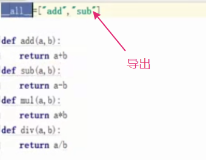{width="2.8333333333333335in"
height="2.2in"}

导入包

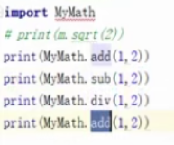{width="1.6083333333333334in"
height="1.3416666666666666in"}

或者

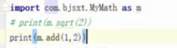{width="2.4166666666666665in"
height="0.6583333333333333in"}

### 列表推导式

i=\[result1,result2\...\]

i=\[result for i in range(1,10) if i%2==0\]

print i

结果是\[2,4,6,8\]

### 数据库操作

from pymysql import \*

#### 连接

conn=connect("地址","user","password",'database',端口)

#### 语句执行

cur=conn.cursor()

count=cur.excute("select \* from 表")

result=cur.fetchall()

conn.close()

======增

count=cur.excute("insert语句")

conn.commit()

# 机器学习

## **分类和聚类**

分类是监督学习，原始数据有标签，可以根据原始数据建立模型，确定数据属于哪一类

聚类是一种无监督学习，事先没有标签，在数据中发现数据对象关系。将数据分组，一个分组为一个簇，组内相似性越大，组间差别越大，聚类效果越好，用于知识的发现而不是预测

## 线性回归

回归：因变量与自变量的关系，在机器学习中解决的问题就是值预测

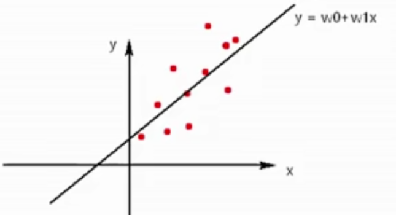{width="5.375in"
height="2.9166666666666665in"}

一元线性回归：w0截距，w1权重，x特征，维度，y对应值

error:(1/2m)\*Σ(y-[y~0~]{.underline})^2^
越小，点越接近直线，等于0，点在直线上

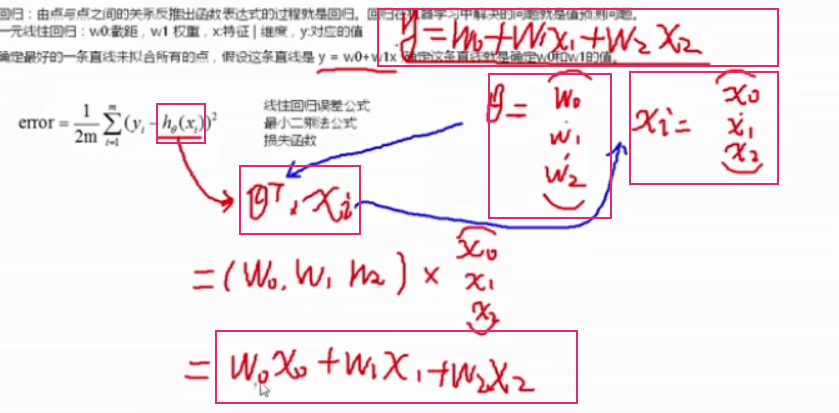{width="5.761111111111111in"
height="2.8361111111111112in"}

要想确定w0w1值，就是找到error最小值对应的θ

error误差公式是error关于θ的函数，图像开口向上，有极小值，可以求导，当导数为0，error有最小值

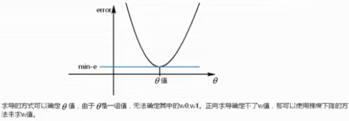{width="5.7659722222222225in"
height="2.0006944444444446in"}

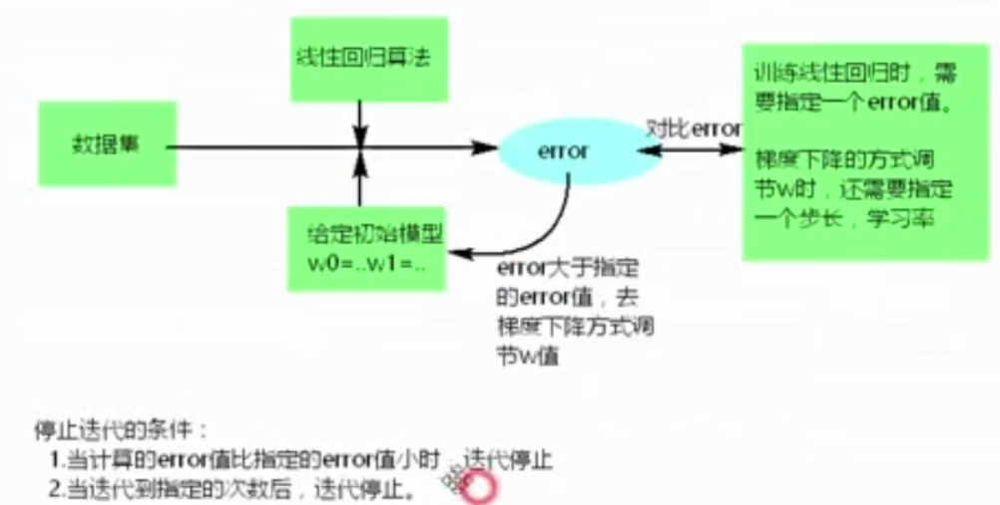{width="5.761805555555555in"
height="2.915277777777778in"}

### 过拟合

数学模型对目前给出的点拟合很好，但是预测误差大

对已有数据拟合太好，几乎满足给出的每个点

当训练集(给出的点)非常少，特征非常多，容易出现过拟合的问题

### 欠拟合

模型对目前给出的点拟合差，预测也差

## 贝叶斯分类算法

### 公式

> 

也可以简写为：

> 其中:
>
> P(A)叫做A事件的先验概率，即一般情况下，认为A发生的概率。
>
> P(B\|A)叫做似然度，是A假设条件成立的情况下发生B的概率。
>
> P(A\|B)叫做后验概率，在B发生的情况下发生A的概率，也就是要求的概率。P(B)叫做标准化常量，即在一般情况下，认为B发生的概率。

### 拉普拉斯估计

本质上是给频率表中的每个单词的计数加上一个较小的数，这样就保证每一类中每个特征发生的概率非零。通常，拉普拉斯估计中加上的数值为1，这样就保证了每一个特征至少在数据中出现一次。

防止计算中分母为0

## K最近邻算法(KNN)\--分类

思路

如果一个样本在特征空间中的k个最相似的样本中的大多数属于某一个类别，则该样本也属于这个类别

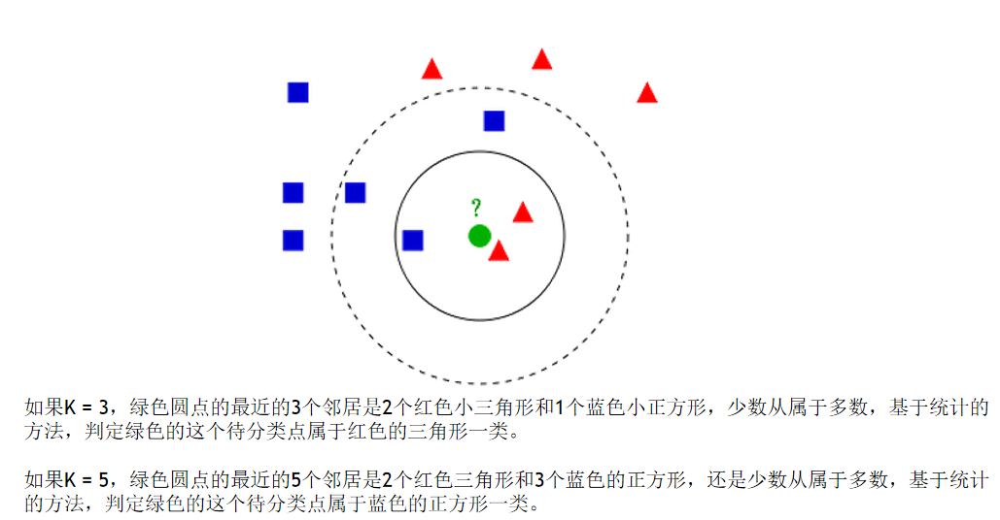{width="5.7625in"
height="3.001388888888889in"}

> **距离度量**

### 欧式距离

> 也称欧几里得距离，在一个N维度的空间里，求两个点的距离，这个距离肯定是一个大于等于零的数字，那么这个距离需要用两个点在各自维度上的坐标相减，平方后加和再开方。一维，二维，三维的欧式距离计算方法：一维：
> 二维：
> 三维：

### **平方欧式距离：**

就是欧式距离的平方

> **KNN数据归一化：**
>
> 为了防止某一维度的数据的数值大小对距离计算产生影响，保证多个维度的特征是等权重的，最终结果不能被数值的大小影响，应该将各个维度进行数据的归一化，把数据归一化到\[0,1\]区间上。
>
> 归一化公式：
>
> **步骤**

1计算当前分类的样本到所有样本的距离

2按照距离从小到大的排序，取出钱K个

3最近的K个邻居中，大多数属于哪一类，当前样本也属于哪一类

> **三要素**

#### 1k值的选择，K不会大于20

#### **2距离的度量**

#### **3分类的决策**

少数服从多数

**knn问题**

当样本存在不均匀现象时，样本很容易分类到大容量样本中

解决：给距离加权，权重：距离平方的倒数

**距离度量**

> **欧式距离**：也称欧几里得距离，在一个N维度的空间里，求两个点的距离，这个距离肯定是一个大于等于零的数字，那么这个距离需要用两个点在各自维度上的坐标相减，平方后加和再开方。一维，二维，三维的欧式距离计算方法：一维：
> 二维：
> 三维：
>
> **平方欧式距离：**就是欧式距离的平方。
>
> **曼哈顿距离**：相比欧式距离简单的多，曼哈顿距离只要把两个点坐标的x坐标相减取绝对值，y坐标相减取绝对值，再加和，
> 。三维，四维以此类推。
>
> **余弦距离**：也叫余弦相似度，是用向量空间中两个向量夹角的余弦值作为衡量两个个体间差异的大小的度量。如果两个向量的方向一致，即夹角接近零，那么这两个向量就越相近。要确定两个向量方向是否一致，要用到余弦定理计算向量的夹角。
>
> **闵可夫斯基距离**：闵式距离不是一种距离，而是一组距离的定义，是对多个距离度量公式的概括性表述。定义：两个n维变量（可以理解为n维数组，就是有n个元素）a()与b()间的闵可夫斯基距离定义为：
> 其中p是一个变参数，当p=1时，就是曼哈顿距离，当p=2时，就是欧式距离，当p
> 就是切比雪夫距离。
>
> **切比雪夫距离**：国际象棋中，国王可以直行、横行、斜行。国王走一步，可以移动到相邻的8个方格的任意一个。国王从格子
> 到格子最少需要多少步？这个距离就是切比雪夫距离。
>
> 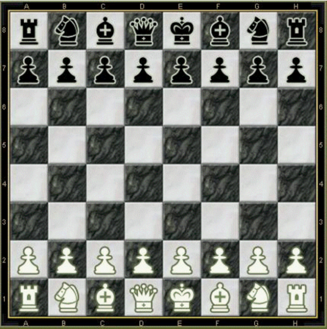{width="2.4347222222222222in"
> height="2.4541666666666666in"}
>
> 切比雪夫距离公式简单理解为就是各坐标数值差的最大值，在2维空间中的计算公式为：
> 。
>
> **谷本距离：**同时考虑余弦距离和欧式距离的测度。
>
> **加权距离测度**：可以指定某一维度的权重比例，从而使某个权重的影响力更大。

## kmeans算法\--聚类算法

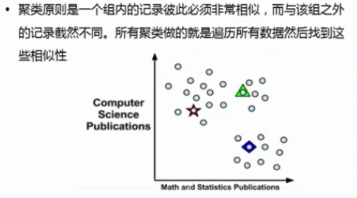{width="4.891666666666667in"
height="2.716666666666667in"}

随机选3中心点

计算其它每个点到三个中心的距离

当前点离哪个中心点最近，就属于哪个簇

每个簇重新选择3个中心点

下次继续以这3个中心点重新聚类

### 特征

无监督聚类算法，用于发现知识，发现数据共性

### 定义

质心：每个聚类的中心点

簇：每个聚类也叫一个簇

### 步骤

1随机找到k个中心

2计算所有点到当前k个中心点的距离，当前样本点归属于距离中心点最近的哪个中心点的组

3经过所有点计算之后，每个点都属于k个组的某一组，重新确定每个组的质心

4重复2-3步骤，直到质心不再变化或者达到一定的迭代次数停止

### 聚类好坏

类与类之间差异性大，类内部相似性高，聚类越好

### 如何选择k

#### 知道有几类

#### 肘部法选择k

### kmean++算法

kmean算法问题：开始选择k个中心点如果在一起，会导致迭代次数增多

用kmean++解决

kmean++与kmean一样，在开始初始化中心点时，选择下一个中心点时，离之前的中心点距离越远的点越有大概率被当作下一个中心点

# 模块

## time

### sleep(n)睡眠

### 格式化日期\|.strftime(\"%Y-%m-%d %H:%M:%S\", time.localtime())

### **获取秒级时间戳与毫秒级时间戳、微秒级时间戳**

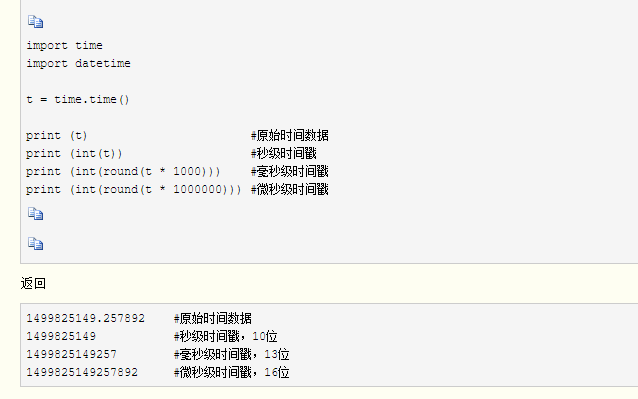{width="5.316666666666666in"
height="3.325in"}

## python语音朗读

1.安装python2.7

2.安装pyttsx: 

pip install pyttsx

（需安装pip）

github下载地址：https://github.com/westonpace/pyttsx

3.安装pywin32(对应python版本)

下载地址：https://sourceforge.net/projects/pywin32/files/pywin32/

代码1只需pywin32

#-\*-coding:utf8-\*-

import win32com.client

speaker = win32com.client.Dispatch(\"SAPI.SpVoice\")

speaker.Speak(\"hello\")

代码2：

\# coding:utf-8

import sys

reload(sys)

sys.setdefaultencoding(\'utf8\')

\# \_\_author\_\_ = \'郭 璞\'

\# \_\_date\_\_ = \'2016/8/6\'

\# \_\_Desc\_\_ = 文字转语音输出

import pyttsx

engine = pyttsx.init()

engine.say(\'hello world\')

engine.say(\'中文\')

engine.runAndWait()

\# 朗读一次

engine.endLoop()

------------------------------------------------

版权声明：本文为CSDN博主「Roninwz」的原创文章，遵循CC 4.0
BY-SA版权协议，转载请附上原文出处链接及本声明。

原文链接：https://blog.csdn.net/qq_35038153/article/details/78770559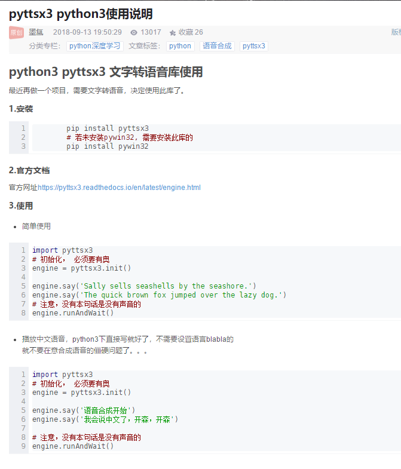{width="5.591666666666667in"
height="6.541666666666667in"}

## random随机数

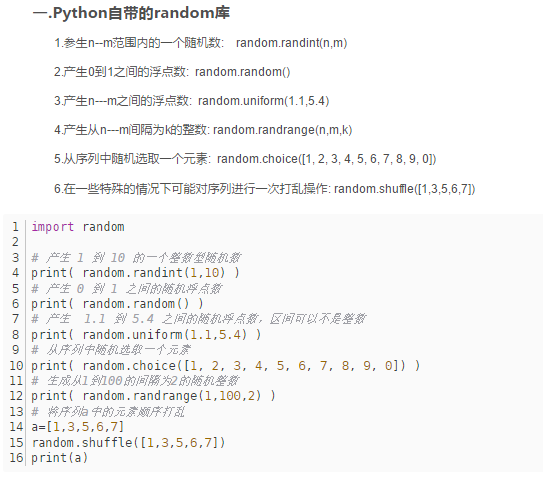{width="4.525in"
height="4.041666666666667in"}

## 科学计算类库Numpy

安装pip install numpy

import numpy as np

#### 矩阵

有几层\[ 就几维

##### 二维数组

array=np.array(\[\[1,2,3\],\[4,5,6\]\])

array.ndim #轴 2 代表二维

array.shape #(2,3) 矩阵n行m列

array.size #2 矩阵n\*m

array.dtype #元素类型

##### 三维数组

array=np.array(\[\[\[1,2\],\[3,4\]\],\[\[5,6\],\[7,8\]\],\[\[9,10\],\[11,12\]\]\])

array.ndim #轴3 代表三维

array.shape #(3,2,2) 矩阵n行m列h深

array.size #12 矩阵n\*m\*h

array.dtype #元素类型

##### 使用range创建数组

np.range(1,10).reshape(3,3)

创建3行3列二维数组

##### 使用随机数创建矩阵

np.random.randint(start,end,size).reshape(a,b,c)

size=a\*b\*c

np.random.randn(a\*b).reshape(a,b) 均匀分布 +

np.random.randn(a\*b).reshape(a,b) 标准正态分布 +或者-

##### 通过固定值生成数组

np.empty(a\*b).reshape(a,b)

np.zeros(a\*b).reshape(a,b)

生成a\*b个值为0的数组

生成a\*b个值为0的数组

np.ones(a\*b).reshape(a,b)

生成a\*b个值为1的数组

##### **多维数组的索引(切片取值)**

**切片：起始值，结束值，步长**

**对于4\*4的2维数组**

###### 取出第一行

array\[0\]

###### **取出第一列**

array\[: , 0\]

###### **取出第一行和第三行**

array\[0::2,\]

###### **取出第二列和第四列**

array\[::,1::2\]

###### **取出第一行和第三行的取第二列和第四列**

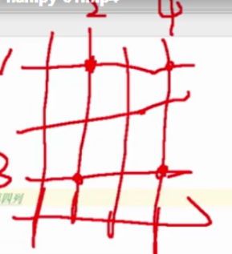{width="1.3152777777777778in"
height="1.4423611111111112in"}

array\[0::2,1::2\]

##### **数组遍历**

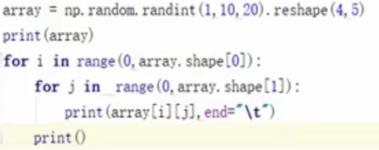{width="5.183333333333334in"
height="2.05in"}

##### **基本运算**

####### 求和

array.sum()求和

array.sum(0)每一列求和

array.sum(1)每一行求和

####### 转置

array.T （将m行n列变为n行m列）

####### 矩阵求逆 

np.linalg.inv()

####### **乘**

np.dot(array1,array2)

array1与array**2必须一个是n行m列一个是m行n列**

##### **形状操作**

###### 扁平化

array.ravel()

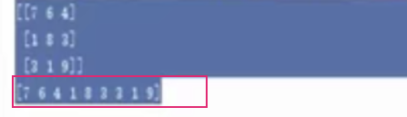{width="3.725in" height="1.075in"}

###### **拼接数组**

**按行**

**np.vstack(arr1,arr2) 或 np.row_stack(arr1,arr2)**

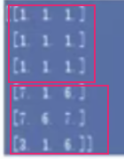{width="1.1666666666666667in"
height="1.5in"}

**按列**

**np.hstack(arr1,arr2)或 np.column_stack(arr1,arr2)**

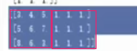{width="2.341666666666667in"
height="0.875in"}

按维度

**np.stack((arr1,arr2),0)**

###### **切割**

**np.split(array,个数,轴)**

**np.vsplit(array,个数,轴)**

**np.hplit(array,个数,轴)**

**对于二维数组0是按照行切，1是按照列**

#### 常用函数

##### 替换

np.where(array\>5,array,替换值)
