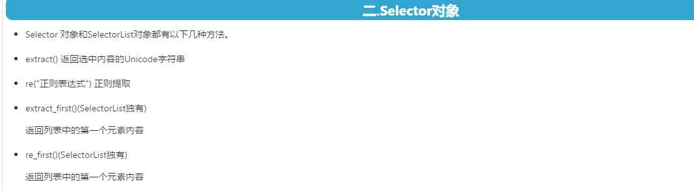

# **环境搭建**

## windows和linux安装python2和python3

1官网选择版本python2下载

{width="5.763888888888889in"
height="2.907638888888889in"}

2安装即可

3命令行输入 python查看版本

{width="5.761111111111111in"
height="0.5805555555555556in"}

====安装python3.5.3

1官网下载

{width="5.758333333333334in"
height="3.1381944444444443in"}

2配置环境变量

\....

{width="5.767361111111111in"
height="5.35625in"}

=====linux安装

1sudo apt-get install python3.5

## python虚拟环境安装

=================================window安装虚拟环境======================

1安装python虚拟环境，好处 将开发环境相互隔离，
使不同项目可以使用不同python版本

命令

pip install virtualenv

2安装项目(使用镜像，以django为例子)

pip install -i
[https://pypi.douban.com/simple/](http://pypi.douban.com/simple/) django
（网址百度搜索豆瓣源获得,注意协议头可能加https才有效）

卸载命令pip uninstall django

3

======》在当前目录 新建项目用默认的python环境

virtualenv 项目名

======》在当前目录 新建项目用自定义的python环境

virtualenv -p 你python安装根目录位置/python.exe 项目名

4进入这个虚拟环境

进入这个项目目录，然后进入Scripts文件夹

然后运行 activate.bat命令

之后就可以运行python相关命令了

退出虚拟环境

deactivate.bat 命令

=================================linux安装虚拟环境======================

1sudo apt-get install python-virtualenv

2======》在当前目录 新建项目用默认的python环境

virtualenv 项目名

3======》在当前目录 新建项目用自定义的python环境

virtualenv -p 你python安装根目录位置/python.exe 项目名

4进入这个虚拟环境

进入这个项目目录，然后进入bin文件夹

然后运行source activate命令

之后就可以运行python相关命令了

退出虚拟环境

deactivate 命令

## **python虚拟环境管理工具**

=================================虚拟环境管理包(window下)======================

1安装：**管理员模式运行cmd才行。**

pip install virtualenvwrapper-win

2配置环境变量\-\--配置默认的项目在哪个目录创建

{width="5.7625in"
height="1.6145833333333333in"}

修改后重启cmd

2列出所配置目录中的所有虚拟环境

workon

3使用默认python环境新建项目

mkvirtualenv 项目名

使用自定义python版本创建项目

mkvirtualenv \--python 安装的python根目录\\python.exe 项目名

创建后会自动进入项目环境，

4使用deactivate退出环境

5使用workon 项目名 进入环境

=================================虚拟环境管理包(linux下)======================

1安装：**管理员模式运行cmd才行。**

pip install virtualenvwrapper

2找到默认安装目录

sudo find / -name virtualenvwrappe.sh

复制路径配置环境变量

2配置环境变量\-\--配置默认的项目在哪个目录创建

进入配置文件

vim \~/.bashrc

{width="5.763888888888889in"
height="2.370833333333333in"}

修改后

source \~/.bashrc

2列出所配置目录中的所有虚拟环境

workon

3使用默认python环境新建项目

mkvirtualenv 项目名

使用自定义python版本创建项目

mkvirtualenv \--python 安装的python根目录\\python.exe 项目名

创建后会自动进入项目环境，

4使用deactivate退出环境

5使用workon 项目名 进入环境

## 在虚拟环境中安装项目

### 安装scray

1首先通过虚拟环境管理创建项目

mkvirtualenv 项目名

创建后会自动进入该目录或使用

workon 项目名

进入项目目录

2在项目目录安装依赖包

pip install -i https://pypi.douban.com/simple/ scrapy

3出错：

{width="5.7625in"
height="1.8152777777777778in"}

安装项目失败势进入这个网址找到python版本所对应的依赖版本下载并安装

<https://www.lfd.uci.edu/~gohlke/pythonlibs/>

找到后下载，后进入项目所在环境，运行pip install 下载的文件地址安装

依赖弄好后，重新安装

{width="5.767361111111111in"
height="5.448611111111111in"}

# 爬虫基础知识

## scrapy与requests+beautifulsoup区别

{width="5.763194444444444in"
height="1.93125in"}

## 网页分类与爬虫作用

1静态网页

2动态网页

3webservice(restapi)

作用：

搜索引擎\-\--百度(爬取所有页面),垂直领域搜索引擎(只搜索某类信息)

推荐引擎\-\--今日头条

机器学习的数据样本

数据分析(金融数据分析)，舆情分析

## 正则

{width="5.761805555555555in"
height="1.8763888888888889in"}

## 字符串编码

1计算机只处理数字

2 8个位一个字节

3一个字节能表示最大数255

4用一个字节的ascii码表示字符 **ASCII编码\-\--美国人标准编码**

5但是，中文来说，指定了GB2312编码

用2个字节代表一个汉字
**GB2312\-\-\-\--用2个字节代表一个汉字(包含了ascii码)**

6不同国家不同编码，为了统一到一套编码，出现
**unicode编码\-\--统一不同国家编码**

{width="5.761805555555555in"
height="1.7006944444444445in"}

7为了解决unidode编码浪费空间问题，出现了
**utf-8编码\-\--可变长统一不同国家的编码**

英文1个字节

汉字3个字节，生僻字4-6字节

### 不同编码不同场景

{width="5.767361111111111in"
height="3.4506944444444443in"}

### **默认编码**

window gb2312

linux utf8

### 编码解码unicode \| utf-8

{width="5.767361111111111in"
height="3.4506944444444443in"}

#### **字符串指定编码**

默认utf-8

指定unicode通过

s=u"字符串"

#### encode编码\-\--将二进制（unicode）编成其它编码

s.encode('utf8')

想将s编码为utf8，s必须是unicode才行

若s是gb2312编码

则

s.decode("gb2312").encode("utf8")

#### decode('其它编码类型')解码\-\-\--将其它编码的字符串变成二进制（unicode）

## **爬虫时的编码问题**

### \'gbk\' codec can\'t encode character \'\\xa0\'

文本..encode(\"utf-8\").decode(\'utf-8\',
\'ignore\').replace(u\'\\xa0\', u\'\')

注意xa0，有时会变化，要根据提示来

## **深度优先和广度优先**

### 网站url树结构

简单

{width="5.754166666666666in"
height="2.4118055555555555in"}

有环(大部分都这样)

{width="5.768055555555556in"
height="2.6125in"}

### **深度优先(递归算法实现)**

{width="5.408333333333333in"
height="3.3583333333333334in"}

#### 算法实现

{width="5.768055555555556in"
height="1.8409722222222222in"}

### **广度优先(队列算法实现)**

{width="5.766666666666667in"
height="2.9243055555555557in"}

#### 算法实现

{width="5.767361111111111in"
height="4.079166666666667in"}

## 爬虫去重策略

爬虫需要去重，不然陷入不停的循环

1.  将url保存于数据库，下一次查询是否被获取过了，简单效率低

2.  将访问过的url保存到set中，缺点是内存占用会越来越大

3.  **url经过MD5编码变成固定长度保存到set，节省内存(推荐)**

4.  用bitmap()方法，将访问过的url通过hash函数映射到每一位，一个位确定一个url，能进一步节省内存，但是冲突很高

5.  **bloomfilter()方法对bitmap改进，多重hash函数降低冲突，也更节省内存(推荐)**

## **session与cookie**

**http是无状态的请求**

有状态的请求通过cookie记录登陆信息(不安全)和sessio(安全，session也是借助cookie实现通过sessionid)实现

session存放的信息是安全的，原因在于它通过只存sessionid到cookie中，当用户通过sessionid访问时，服务端根据sessionid查询用户信息

这个过程中，用户只有sessionid

## **http状态码**

404页面和状态码，有利于搜索引擎优化

{width="5.764583333333333in"
height="2.4166666666666665in"}

# **爬虫需要的库\-\--核心**

## **scrapy库**

### **生成爬虫spider\-\-\--继承scrapy.spider \| scrapy genspider 任务名 域名**

### 运行爬虫任务\|scrapy crawl 任务名

### **对某url获取的内容快速调试**

在命令行输入

scrapy shell url网址

{width="5.761805555555555in"
height="1.7944444444444445in"}

{width="5.766666666666667in"
height="1.6666666666666667in"}

#### 配置代理

scrapy shell -s USER_AGENT="\..." url网址

### **main.js中代码运行爬虫任务**

from scrapy import cmdline

cmdline.execute(\'scrapy crawl okzyw\'.split(\' \'))

{width="5.761805555555555in"
height="3.529166666666667in"}

### **Spider模块\-\-\--爬虫解析**

{width="5.768055555555556in"
height="2.154166666666667in"}

#### **可重写的方法**

##### **start_requests(self) \-\-\-\--在parse之前执行，必须返回数组，数组中是response**

##### parse(self,response)\-\-\-\--在爬取页面完之后运行这个方法，response是内容对象

###### **response类型**

**url ：**HTTP响应的url地址,**str类型**

**status：**HTTP响应的状态码, **int类型**

**headers ：**HTTP响应的头部, 类字典类型,
可以调用get或者getlist方法对其进行访问

**body：**HTTP响应正文, **bytes类型**

**text：**文本形式的HTTP响应正文, **str类型**

**response.text = response.body.decode(response.encoding)**

**encoding：**HTTP响应正文的编码

**reqeust：**产生该HTTP响应的Reqeust对象

**meta：**即response.request.meta, 在构造Request对象时,
可将要传递给响应处理函数的信息通过meta参数传入, 响应处理函数处理响应时,
通过response.meta将信息提取出来

**selector：**Selector对象用于在Response中提取数据使用下面详细将,主要是 **xpath,css取值之后的处理**

**xpath(query)：**下面详细讲解

**css(query) ：**下面详细讲解

**urljoin(url) ：**用于构造绝对url, 当传入的url参数是一个相对地址时,
根据response.url计算出相应的绝对url.

###### response.xpath('')\-\--可以找到具体元素\|返回值 \-- SelectorList

####### SelectorList

输出文本\|.extract()\[0\] 或者.extract_first("")

区别在于前者数组为空时会抛出异常，后者默认返回空字符串，当然也可以自定义

{width="5.7652777777777775in"
height="1.5951388888888889in"}

####### **xpath库**

{width="5.767361111111111in"
height="2.808333333333333in"}{width="5.767361111111111in"
height="2.4319444444444445in"}{width="5.767361111111111in"
height="2.1284722222222223in"}

元素定位

class定位

1response.xpath(\'//div\[@class=\"1\"\]/div\[@class=\"2\"\]/h2/text()\')

全局找到class为1的div，然后在里面找class为2的div，再找到h2标签。通过text()获取文本节点

2如果一个元素有多个class 例如 \
\</p\>

那么不应该使用=,应该包含

通过xpath(\'//p\[**contains(**\@class,"1"**)**\]/text()\')

**id定位**

1response.xpath(\'//\[id=\"1\"\]/h2/text()\')

全局找到id为1的元素下面的标签中的文本

**属性定位**

xpath("//a\[@href='\...'\]")

###### **response.css('') \-\--可以通过css找到具体元素\|**返回值 \-- SelectorList

####### SelectorList

输出文本\|.extract()\[0\] 或者.extract_first("")

区别在于前者数组为空时会抛出异常，后者默认返回空字符串，当然也可以自定义

{width="2.95in" height="3.225in"}

####### **css选择器库**

{width="5.7659722222222225in"
height="2.879166666666667in"}{width="5.7555555555555555in"
height="1.88125in"}{width="5.7652777777777775in"
height="0.8215277777777777in"}

元素定位\|用法 css("标签+css选择器")或者css("css选择器")

**css("css选择器")**

css(".类 h1::text")

取到 类下的h1标签中的文本

**css("标签+css选择器")**

css("p.类名::text")

取到指定类名的p元素的文本

取文本：：text

css("p.类名::text")

取到指定类名的p元素的文本

**取属性：：attr(属性名)**

css("a::attr(href)")

取a标签的url

**css属性定位**

**css('a\[href=".."\]')**

**css一个元素多个类表示方法**

比如\
\</p\>

css("类1类2")

**css定位下一个兄弟节点**

css("当前选择器 + 下一个标签")

例如：

css("h1 + p")

找到h1标签后的p标签

###### **response.url \|获取当前爬取的url**

###### **response.text\|获取响应文本**

#### **本身模块功能**

##### 发送请求\| scrapy.Request("url",headers=请求头,callback=请求后执行)\-\--如果不写回调函数，会调用parse方法

其中callback指向的函数能获取到请求返回的response

##### **发送表单提交请求\|scrapy.FormRequest(url="",formdata=表单数据,headers=请求头数据,callback=下一步指向的函数)**

##### **交给scrapy爬取url并回调\-\--参数传递\|yield scray .Request(url="url",callback=回调函数)**

如果要传递给下一个回调函数 一些值，可以定义再meta属性里面

scrapy.Request自带Session与request

为了保证每个Request的session是同一个

要用yield交给下载器

==============

====比如

yield Request(url="url",meta={"key":value}callback=回调函数)

注意meta={"key":value}callback之间是连续的

====在回调函数的response取出传递过来的值

def myParse(self,response):

response.meta\["key"\] \-\-\-\--以元组形式取，若空会抛异常

response.meta.get("key","")
\-\-\--通过get方式取，取不到不抛异常，用定义的默认值填充

### **Item模块(相当于pojo实体类)\-\-\--将spider模块中的字段提取到Item中处理\-\--可以定义多个实体类**

#### 在item中声明自定义的item类以及在自定义的item类声明需要提取的字段

{width="5.7659722222222225in"
height="3.7694444444444444in"}

#### **生成id**

**md5根据url生成hashID**

{width="5.7659722222222225in"
height="1.1416666666666666in"}

#### **(封装方式1)在spider中将自定义的Item类(实体类)导入到splider模块中在splider赋值填充**

在spider模块中导入item类：

导入格式： from 项目名.items import 实体类

导入后的用法：

实体对象=实体类()

实体对象\["字段"\]=\.... #完成填充

{width="5.759722222222222in"
height="4.834027777777778in"}

#### **(封装方式2)通过ItemLoader**

from scrapy.loader import ItemLoader

##### **例子**

{width="3.05in"
height="0.4083333333333333in"}

{width="5.763194444444444in"
height="3.7354166666666666in"}

别人比较完整的：

{width="5.7625in"
height="2.6465277777777776in"}

##### **对象实例化\|itemLoader=ItemLoader(item=实体类对象,response=response)**

###### **添加字段和对应的值或规则\|itemLoader.add\***

####### add_value("字段",值) \| 封装普通字段

####### **add_css("字段","css选择器") \|提取css选择器的内容封装到字段**

这样就不用写response.css('..')了

####### **add_xpath(\...)\|提取xpath对应的内容封装到字段**

###### **解析规则并封装 \| task=itemLoader.load_item()**

###### **将任务交给scrapy \| yield task**

##### **解决封装值预处理的问题(过滤器)**

在items.py中

{width="4.133333333333334in"
height="0.4083333333333333in"}{width="5.766666666666667in"
height="5.840277777777778in"}

匿名函数用法(暂时不看)：

{width="5.763194444444444in"
height="1.6222222222222222in"}

##### **解决封装值是list的问题**

**在items.py中**

{width="5.7652777777777775in"
height="4.718055555555556in"}

#### **在splider中将填充后的item实体类对象交给pipelines模块处理**

yield 实体对象 #将实体对象传递到pipelines中处理

{width="5.761805555555555in"
height="5.524305555555555in"}

#### 注意

不能在实体类初始化

#### **补充**

##### 实体类也可以定义函数，后在pipeline中调用

{width="5.7659722222222225in"
height="1.4791666666666667in"}

调用

{width="5.766666666666667in"
height="0.42916666666666664in"}

### **pipeline模块\-\--对pojo处理\-\--数据存储**

#### 打开pipeline注释

在settings.py中

{width="5.7659722222222225in"
height="4.928472222222222in"}

#### **一个pipeline如何识别多个item实体类**

第一种方式：通过class名来区分(不推荐，写死了)

item.\_\_class\_\_.\_\_name\_\_=="item实体类1"

{width="5.763888888888889in"
height="1.9243055555555555in"}

第二种方式：

多个item在存储的时候只是sql语句不同，所以可以把这个sql语句在不同的item中定义一个相同的函数来处理

def get_insert_sql(self):

        sql = \"\"\"

            INSERT INTO film(id,name,url,types,timez) VALUES(%s,%s,%s,%s,%s)

        \"\"\"

        params = (self\[\'id\'\],self\[\'name\'\],self\[\'url\'\],self\[\'types\'\],self\[\'timez\'\])

        return sql, params

{width="5.7625in"
height="4.321527777777778in"}

#### 实现自动下载图片

##### 在settings.py配置ImagesPipeline类,下载地址，存储路径 \-\-\--能实现自动下载图片

{width="5.7652777777777775in"
height="4.058333333333334in"}

放大：

{width="5.7659722222222225in"
height="1.288888888888889in"}

注意，运行可能报错说没有pil库，需要安装

pip install -i <https://pypi.douban.com/simple> pillow

注意：实体类imageurl字段必须是数组格式

###### 其它配置

#配置下载图片的最低宽度，高度要求

IMAGES_MIN_HEIGHT

IMAGES_MIN_WIDTH

##### **获取 imageurl字段 对应的下载路径**

下载路径名是随机的

###### **自定义图片处理pipeline**

{width="5.7659722222222225in"
height="4.118055555555555in"}

放大

{width="5.761111111111111in"
height="2.8680555555555554in"}

###### **settings.py配置修改默认的ImagePipeline处理类为自己的处理类**

{width="5.763194444444444in"
height="3.8513888888888888in"}

放大

{width="5.761111111111111in"
height="1.6590277777777778in"}

#### **实现保存实体类为json数据**

##### 写一个自定义的pipeline类

{width="5.7659722222222225in"
height="3.4694444444444446in"}

放大：

{width="5.761805555555555in"
height="2.95625in"}

##### **在settings.xml中配置自定义的类的执行顺序**

{width="5.763888888888889in"
height="3.5444444444444443in"}

放大：

{width="5.764583333333333in"
height="1.882638888888889in"}

#### **实现保存实体类为json数据另一种方式(还能保存为表格等形式)**

pipeline中

{width="3.6333333333333333in"
height="0.31666666666666665in"}

{width="5.759027777777778in"
height="1.8583333333333334in"}

settings.xml中{width="5.768055555555556in"
height="4.032638888888889in"}

#### **同步实现保存实体类到数据库**

##### 根据实体类字段建表

##### **在当前项目虚拟环境中安装mysql的驱动**

pip install -i https://pypi.douban.com/simple mysqlclient

注意在linux下需要安装

yum install python devel mysql devel

##### **定义mysqlPipeline** 

{width="3.625in"
height="0.2833333333333333in"}{width="5.766666666666667in"
height="1.801388888888889in"}

##### **配置执行顺序**

{width="5.558333333333334in"
height="1.4333333333333333in"}

#### **异步实现保存实体类到数据库\--推荐**

##### 在settings.py配置mysql基本信息

{width="5.7659722222222225in"
height="3.9604166666666667in"}

##### **写自定义的pipeline类**

{width="3.9916666666666667in"
height="1.0in"}{width="5.7659722222222225in"
height="5.238194444444445in"}

##### **settings.py配置执行顺序**

## **补充**

### **生成爬虫crawl\-\-\--继承crawlSpider \|scrapy genspider -t crawl 任务名 域名**

crawlSpider对spider进行了进一步包装

在crawlspider中不能重写parse函数

结构

{width="5.768055555555556in"
height="3.5909722222222222in"}

这里，有空去学

### **Request参数**

{width="5.759027777777778in"
height="0.5923611111111111in"}

### **底层思路**

spider yield request 给engine,engine发送给scheduler
，然后downloaer下载页面完成后返回给engine,engine再交给spider

### **selector对象-抓取网页元素**

{width="5.7652777777777775in"
height="1.5951388888888889in"}

#### .css（）

#### **.xpath('\....')**

##### 取包裹中的文本

#### **.extract()\[0\] 取对象中的文本**

# **\*\*用scrapy爬取文章网站**

## 新建项目

mkvirtualenv \--python D:\\Develop\\python\\python.exe article

## 安装scrapy依赖

pip install -i https://pypi.douban.com/simple/ scrapy

## **新建scrapy工程**

手动进入你的项目目录中，再进入该项目的运行环境workon 项目名

运行命令：

scrapy startproject 工程名

{width="5.761111111111111in"
height="1.3069444444444445in"}

## pycharm导入项目

{width="4.891666666666667in"
height="3.775in"}

## pycharm给项目导入解释器

{width="5.753472222222222in"
height="1.3611111111111112in"}{width="5.758333333333334in"
height="3.511111111111111in"}

## **新建一个爬虫\|scrapy genspider 任务名 域名**

**进入到项目目录运行**

{width="5.7625in"
height="0.7215277777777778in"}

生成的文件

{width="5.7652777777777775in"
height="2.6909722222222223in"}

## **命令行运行爬虫任务\|scrapy crawl 任务名**

{width="5.7652777777777775in"
height="3.142361111111111in"}

## **禁止scrapy过滤不符合robot协议的url**

不然爬虫很快就会停掉

{width="5.767361111111111in"
height="4.519444444444445in"}

## 新建main.py调试运行爬虫任务

添加断点

{width="5.7659722222222225in"
height="3.126388888888889in"}

运行main.py

{width="6.742361111111111in"
height="3.11875in"}

\# -\*- coding:utf-8 -\*-

#@Time : 2020/4/3 15:11

#@Author : Gva

#@Web : anets.cn

import win_unicode_console

win_unicode_console.enable()

import os

import sys

from scrapy import cmdline

from utils.common import getMd5

import json

sys.path.append(os.path.dirname(os.path.abspath(\_\_file\_\_)))

\# print(\"哈哈\")

print(os.path.dirname(os.path.abspath(\_\_file\_\_)))

cmdline.execute(\'scrapy crawl crawlOkzyw\'.split(\' \'))

\# dsn=\[1,2,34\]

\# json.dumps(dsn,ensure_ascii=False)

\# print(getMd5(\'\'))

## spider模块 \-\-\--爬取文章整体思路

{width="5.763194444444444in"
height="5.195138888888889in"}

在parse方法里面

1要解析文章详情页列表所有url为detailUrls

2对detailUrls遍历，对于每个detailUrl，再调用详情页的解析函数

3提取下一页并交给scrapy进行下载，直到没有下一页

{width="5.764583333333333in"
height="4.2659722222222225in"}

## item模块\--items.py \-\-\--思路

item模块是实体pojo模块，在这里声明实体字段，然后在spider模块中被初始化

在pipeline模块中进行处理

## pipeline模块

对item实体的处理，存储，下载等

# **涉及深度优先的爬取思路**

1首先提取处首页的所有url,过滤url为自己想要的urls

就

2遍历每个url,对每个url的内容进行爬取，解析，然后封装

yield scrapy.Request(url,callback=自定义的解析函数)

# request模拟session与cookie登陆

## **相关知识**

### requests模块

首先，需要安装requests :pip install -i
[https://pypi.douban.com/simple](http://pypi.douban.com/simple) requests

再导入：import requests

#### **获取session\|session=requests.session()** 

##### **携带cookie访问**

###### 指出cookie存储地址\| session.cookies = cookielib.LWPCookieJar(filename=\'保存的cookie文件名\')

###### **加载cookie\|session.cookies.load(ignore_discard=True, ignore_expires=True)**

##### get请求\|response=session.get("url"，headers=请求头,allow_redirects=Fasle)

###### response.text \|获取响应文本

###### **response.status_code \|获取响应状态码**

###### **response.headers \|获取响应头**

###### **response.content \|页面内容**

##### **post请求\|response=session.post("url",data=提交数据,headers=头信息)**

##### **保存cookie**

###### 导入cookielib模块

try:

import cookielib #python2

except :

import http.cookiejar as cookielib #python3环境

###### **session.cookies=cookielib.LWPCookieJar(filename="文件名.text")**

###### **保存请求后存的cookie \| session.cookies.save(参数)** 

有的网站不填参数获取不到cookie,此时添加上参数

session.cookies.save(ignore_expires=True, ignore_discard=True)

##### **保存页面**

with open(\"renren1.html\",\"w\",encoding=\"utf-8\") as f:

f.write(response.content.decode())

## 步骤

### 1新建一个login.py

{width="5.761805555555555in"
height="5.539583333333334in"}

# **scrapy模拟session与cookie登陆**

## 在项目的虚拟环境中生成一个spider

进入自己的项目目录，再进入虚拟环境

scrapy genspider 文件名 要爬的域名

## **写splider**

{width="5.7659722222222225in"
height="3.6145833333333335in"}

# **突破反爬虫**

{width="5.764583333333333in"
height="1.961111111111111in"}{width="5.766666666666667in"
height="2.825in"}

爬虫与反爬虫对抗

{width="5.764583333333333in"
height="3.426388888888889in"}

phantomjs是无界面浏览器

selenium可以操纵浏览器

## scrapy突破反爬虫限制

{width="5.7625in"
height="4.863888888888889in"}{width="5.759027777777778in"
height="3.798611111111111in"}

### 随机切换user-agent

反爬虫网站会对user-agent识别

User-Agent：代理，是一个特殊字符串，标识访问的浏览器信息

#### 普通的方式

就是在header里设置User-Agent一个固定值然后加到Request参数中

{width="5.3in" height="0.925in"}

#### 改进的方式：

1将所有代理写到list中，这里2个为例子

{width="5.558333333333334in"
height="0.825in"}

2生成随机数，在list长度之间，根据随机数取

{width="4.841666666666667in"
height="1.4583333333333333in"}

#### 更高级的方式：

上面的切换每个爬虫都要写，这样耦合性高，为了松耦合：

spider到downloader中间需要经过middleware

所以可以在middleeware中添加头信息，这样就不用在多个spider中重复添加headers

##### a在生成的middlewares.py中定义自己的UserAgent处理类，继承object即可

{width="5.7652777777777775in"
height="4.1097222222222225in"}

\-\-\-\-\--以下是文字版

#导入前需要pip install fake-useragent   \|

from fake_useragent import UserAgent

class  RandomUserAgentMiddleware(object):

    #随机更换user-agent类

    # 构造函数接受传递过来的crawler

    def \_\_init\_\_(self,crawler):

        super(RandomUserAgentMiddleware,self).\_\_init\_\_()

        #1从settings.py配置文件中取出代理集合

        # self.user_agent_list = crawler.settings.get(\"user_agent_list\",\[\])

        #2从github中维护的fake-useragent中取出代理集合,更多详细的设置自己可以去github搜

        self.ua=UserAgent()

    

    #重写from_crawler()函数，这个函数会传递crawl过来\|@classmethod静态方法，python基础知识

    @classmethod

    def from_crawler(cls,crawler):

        # 为了将crawler传递给我们自定义的类

        return cls(crawler)

    

    #重写process_request,设置user-agent

    def process_request(self,request,spider):

        request.headers.setdefault(\"User-Agent\",self.ua.random)

(补充，为了能够不重启spider就能动态切换，而且不用自己维护添加useragnt，需要安装使用fake-useragent)

##### b在settings.py中配置：

{width="5.763888888888889in"
height="0.9381944444444444in"}

### **代理ip的设置**

当同一ip爬取过快的时候，很容易被服务器识别禁止

#### 代理ip原理

{width="5.763194444444444in"
height="5.793055555555555in"}

#### **代理ip实现**

百度免费代理ip有免费的一些代理

其中高匿ip代理，代理服务器携带的请求不包含我们的ip，目标服务器无从知道本机ip

##### 简单的ip代理设置

在middleware.py中自定义middleware类，并在settingx.py中配置，上一级有说明

{width="5.763194444444444in"
height="3.0236111111111112in"}

##### **进阶的ip代理设置**

1可以爬取网上的免费ip代理到数据库中

2然后从数据库中随机查

select ip,port from ip表 order by RAND() limit 1

3得到ip后判断ip是否可用(状态码200-300是ok的)，不可用从数据库删除

通过requests代理请求，请求出错，则无效，请求返回的状态码在200-300之外，也无效

{width="4.916666666666667in"
height="0.6666666666666666in"}{width="4.9875in"
height="3.3368055555555554in"}

{width="3.7916666666666665in"
height="1.1583333333333334in"}

4通过上面的方法得到最终ip，进行简单的ip代理设置

##### **更多**

**tor洋葱网络**

### **验证码识别**

#### **用户自己识别**

##### 1首先获取验证码url

##### 2下载图片

##### 3让程序打开图片

{width="5.666666666666667in"
height="2.191666666666667in"}

##### 4用户识别图片的验证码输入

关键代码：

{width="5.763888888888889in"
height="0.5895833333333333in"}

##### 5将识别的验证码加入到form参数中一起提交

#### **编码实现(tesseract-ocr识别工具)**

识别率低

#### **在线打码\--折中方式**

云打码平台

去看视频把，暂时用不到

#### **人工打码\--价格贵准确率高**

# **爬虫进阶**

## selenium（浏览器自动测试框架，可以在window下用）-动态网站抓取

{width="5.766666666666667in"
height="4.377777777777778in"}

### 在项目的虚拟环境安装

pip install selenium

### **下载对应浏览器的driver**

### **selenimu入门案例**

{width="5.761805555555555in"
height="2.1930555555555555in"}

### **结合selenium的模拟登陆**

{width="5.767361111111111in"
height="1.6284722222222223in"}

### **selenimu模块**

#### webdriver模块

from selenium import webdriver

##### **谷歌浏览器配置对象\|c**hromeOptions

###### 对象获得\|**c**hromeOptions=wbdriver.ChromeOptions()

###### **配置浏览器不加载突破提高访问速度**

{width="5.283333333333333in"
height="0.675in"}

然后把配置对象作为参数传递给Chrome函数

##### 获取谷歌浏览器对象browser=webdriver.Chrome(executable_path="浏览器驱动程序地址")

其他参数:

chrome_options=配置对象

###### 访问\|browser.get("url")

###### **获取访问后的html源码\|browser.page_source**

###### **通过browser本身获取元素(效率低，但互动操作必要)\|browser.find_element\_\*("..")**

获取元素之前，可能页面还没加载完，所以可以睡眠一会

import time

time.sleep(15)

####### **获取元素后如果是输入框可以输入内容\|.send_keys("输入的值")**

####### **点击操作\|.click()**

###### **将html源码交给scrapy的selector以便获取元素**

####### Selector类 \| 来自scrapy.selector

from scrapy.selector import Selector

获取select对象 \| select=Select(text=browser.page_source)

css获取\|selector.css("\...")

###### **执行js脚本\|browser.execute_script("js脚本")**

例如，使鼠标下拉到底部

browser.execute_script(

"

window.scrollTo(0,document.body.scrollHeight;

var lenOfPage=document.body.scrollHeight;

return lenOfPage;)

"

)

###### **关闭窗口\|browser.quit()**

## **phantomjs（无界面浏览器，可以在linux用）\-\--已淘汰**

多进程情况下phantomjs性能会下降严重

### 官网下载phantomjs

然后将程序路径放到selenium中的Chrome("")中替代selenium driver就行了

## **selenium集成scrapy**

### 在middlewares.py中自定义一个类并在settingx.py配置执行顺序

1思路，spider开始爬取后，中间会经过middlewares才进入downloader下载页面

所以在middlewares中对url进行拦截

2过滤出需要动态网页的url，或者需要交互的url

3拦截后，如果需要直接返回，而不用交给downloader下载的话，需要直接响应

from scrapy.http import HtmlResponse

然后在函数最后返回就好

return HtmlResponse(url="",body=,encoding="",request=)

{width="5.761805555555555in"
height="1.8451388888888889in"}

4在settings.py中配置自定义的类

5对以上的优化，每次都要初始化窗口，这样废资源，但如果放到类中，随只初始化一次，但无法关闭，为了解决这个问题，需要把Chrome方法放到spider的初始化方法的属性中，并监听关闭信号

{width="5.766666666666667in"
height="3.2645833333333334in"}

6scrapy本身是异步框架，但是这里同步了，会让性能降低，如果想改成异步，必须重写downloader，可以在github搜索downloader了解

## **elasticsearch\--企业级搜索引擎**

基于lucene,基于Restful接口，分布式多用户能力的搜索引擎

此外还有solr ， elk(日志分析系统)

爬虫后完成搜索功能

场景

{width="5.763888888888889in"
height="2.466666666666667in"}

### 关系数据库缺点

无法打分

无分布式

无法解析搜索请求

效率低

分词

### **非关系数据库**

**redis mongodb**

### **安装**

#### 首先安装java 

并查看版本java -version，要在1.8上

#### **去github下载elasticsearch-rtf中文插件版**

**下载后**

{width="5.7652777777777775in"
height="2.5034722222222223in"}

#### **启动，直接命令窗口运行bin目录下的bat文件**

#### **浏览器访问\|ip地址:9200**

#### **head插件下载安装**

elasticsearch-head插件\--连接数据库

在github下载

##### npm安装依赖

安装如果慢,可以使用npm加速版cnpm

npm install -g cnpm \--registry = https://registry.npm.taobao.org

进入你下载的elasticsearch-head目录

1安装依赖

cnpm install

2启动

cnpm run start

3访问

ip:9100

连接之后会自动连接ip地址:9200，也就是elasticsearch，如果连接不上集群

这是因为elasticsearch不允许第三方服务连接

为了能够访问，需要在elasticsearch进行一些配置

elasticsearch.yml文件配置以下信息

{width="5.763888888888889in"
height="0.6736111111111112in"}

#### **kibana安装**

百度官网下载

下载后运行

bat文件

然后访问 ip:5601端口

{width="5.768055555555556in"
height="2.70625in"}

### **概念**

#### 认知

{width="5.767361111111111in"
height="1.898611111111111in"}{width="5.763194444444444in"
height="2.0381944444444446in"}{width="5.763888888888889in"
height="2.6131944444444444in"}

#### 倒排索引

{width="5.766666666666667in"
height="2.386111111111111in"}

倒排索引，存文件的时候对内容进行分析，分词，把词出现的文档列出来

{width="5.7652777777777775in"
height="2.595833333333333in"}

{width="5.125in"
height="2.2416666666666667in"}

### **基本使用**

#### **kibana的命令操作**

##### 索引的创建

{width="5.763888888888889in"
height="2.1798611111111112in"}

索引创建后不能修改分片数量，分片数量默认5

##### **查询索引信息** 

get 名

###### 查询索引设置信息

**get 名/\_settings**

{width="5.761805555555555in"
height="2.34375in"}

4种方式

{width="4.033333333333333in"
height="1.0833333333333333in"}

###### **查询字段**

**get 索引库/表/id？\_source=字段1,字段2**

**get 索引库/表/id？\_source 获取所有**

##### **更新索引信息**

不能改分片数

put 名/\_settings{

"number_of_replicas":2

}

##### **保存文档到索引库**

put 索引库名/type（表名）/id(可以不写，自动生成){

"字段1":值

}

{width="3.3666666666666667in"
height="1.9in"}

head插件就会显示

{width="5.641666666666667in"
height="0.5666666666666667in"}

##### **修改索引库**

1全部覆盖

put 索引库名/type（表名）/id{

"字段1":值

}

2修改某字段

post 库名/表名/id/\_update{

"doc":{

"字段":值

}

}

##### **删除**

###### **删除文档**

delete 库/表/id

###### **删除type(表)**

delete 库/表

###### 删除库

delete 库

##### **批量操作**

{width="5.759722222222222in"
height="2.93125in"}
{width="3.658333333333333in"
height="2.1333333333333333in"}

#### **映射**

{width="5.756944444444445in"
height="1.8159722222222223in"}

##### 内置类型

{width="5.761805555555555in"
height="3.8986111111111112in"}

###### 内置类型属性

{width="5.757638888888889in"
height="3.0875in"}

### **查询**

#### **准备数据**

##### 添加映射

注意，title字段分词了

{width="5.766666666666667in"
height="5.605555555555555in"}{width="5.5in"
height="0.7583333333333333in"}

##### **添加数据**

{width="5.763888888888889in"
height="3.55625in"}

#### **match查询\--自动分词or查询**

get 库/\_search

{

"query":{

"match":{

"字段":值

}

}

}

{width="3.525in"
height="1.8833333333333333in"}

#### **term查询\-\-\--不对查询条件分词**

get 库/\_search

{

"query":{

"term":{

"字段":值

}

}

}

{width="5.408333333333333in"
height="2.1416666666666666in"}

#### **terms查询**

get 库/\_search

{

"query":{

"terms":{

"字段":\[值1,值2\]

}

}

}

{width="2.9833333333333334in"
height="1.075in"}

#### **分页**

{width="2.125in"
height="1.6666666666666667in"}

#### **match_all查询\--查询所有**

{width="1.8333333333333333in"
height="1.075in"}

#### **match_phrase查询(短语查询)-自动分词and查询**

将条件分词，分成一个数组，与match不同的是

所查字段的值必须包含所有分词后的字段

比如

查询python系统 ，分词后\[python,系统\]

那么所返回的内容必须包含python与系统

slop还可以指定2个词隔开的最大距离

{width="2.933333333333333in"
height="1.8083333333333333in"}

#### **multi_match查询**

可以指定多个字段

{width="3.2666666666666666in"
height="2.0166666666666666in"}

更改权重

{width="3.35in"
height="1.3416666666666666in"}

#### **查询指定返回的字段**

只能返回store定义时设置为true的字段

{width="5.764583333333333in"
height="2.238888888888889in"}

#### **排序**

{width="4.75in" height="3.4in"}

#### **范围查询range**

**lte \<=**

**gte \<=**

**lt \<**

**boost 权重**

{width="4.916666666666667in"
height="3.025in"}

#### **模糊查询wildcard**

**\*代表任意值**

{width="5.763888888888889in"
height="1.9527777777777777in"}

#### **bool查询（filter查询过时）**

{width="1.675in"
height="0.9083333333333333in"}

##### 建立测试数据

{width="2.7333333333333334in"
height="1.4in"}

##### 组合过滤查询

filter对字段过滤，不参与打分

must 中数组里面所有查询都必须满足

should数组里条件只要满足一个或者多个

must_not

{width="4.416666666666667in"
height="3.658333333333333in"}{width="3.5833333333333335in"
height="2.475in"}

##### **嵌套查询**

{width="3.2583333333333333in"
height="0.48333333333333334in"}

{width="3.591666666666667in"
height="3.033333333333333in"}

#### **查看分析器解析的结果**

{width="2.9166666666666665in"
height="1.0583333333333333in"}

#### **过滤空与非空**

##### 建立测试数据

{width="3.05in"
height="1.7916666666666667in"}

##### **通过存在与不存在**

{width="3.575in"
height="2.1166666666666667in"}{width="3.4in"
height="1.7583333333333333in"}

## **elasticsearch+scrapy\-\-\--（可以用java代替哈）**

### 将爬取的数据放入elasticsearch中

在pipeline中将数据写入索引库

#### 安装elasticsearch-py接口包

在项目的虚拟环境中

pip install elasticsearch-dsl

#### **根据 elasticsearch-dsl官方模板建model**

官网：

{width="5.761805555555555in"
height="3.0215277777777776in"}

在自己的model.py里

{width="5.541666666666667in"
height="1.1083333333333334in"}{width="3.55in"
height="3.425in"}

#### **运行这个文件就会建立索引库**

## **其余动态网页获取介绍**

### phantomjs无界面已经过时的替代方案1（linux下）

对于chrome有界面的浏览器，python提供了无界面的环境

如果要在无界面的环境下运行chrome(linux才行)

需要

在项目虚拟环境安装

pip install pyvirtualdisplay

导入

from pyvirtualdisplay import Display

display=Display(visible=0,size=(800,600)) #0是不显示

display.start()

#后面的操作和前面一样

browser = webdriver.Chrome(..)

\...\...\...

## **scrapy的暂停与重启**

1要做到暂停爬虫，需要在开始爬虫spider时指定保存路径(不同spider不能共用同一目录)

crawl spider spider名 -s JOBDIR=保存的相对路径

2暂停是ctrl+c （按2次就是退出，只能按一次）

3重启：和开始爬虫一样的命令

crawl spider spider名 -s JOBDIR=保存的相对路径

## **其他不重要的**

### **scrapy url去重原理**

了解就行，需要重写

{width="5.761805555555555in"
height="2.60625in"}

### **scrapy telnet\-\--远程连接端口操作**

{width="5.766666666666667in"
height="0.74375in"}

1window需要打开自己talent服务

{width="5.761805555555555in"
height="3.6729166666666666in"}

2本地：

运行telnet ip 端口

\-\--连接上你的spider服务器

使用est()命令查看spideer状态

具体参数使用见官网

### **spider与middleware详解**

**见视频**

### **spider数据收集\--存取一些spider信息**

有插件来取收集的数据

{width="5.558333333333334in"
height="2.85in"}

#### 实现失败url统计

{width="5.475in" height="1.7in"}

#### **其他使用**

{width="5.558333333333334in"
height="0.275in"}

### **scrapy信号**

{width="5.767361111111111in"
height="1.479861111111111in"}

#### 使用

{width="5.7659722222222225in"
height="1.4208333333333334in"}

### **scapy扩展开发**

**自己去官网看**

# **分布式爬虫scapy-redis**

## 分布式爬虫要点

{width="5.208333333333333in"
height="3.183333333333333in"}

好处：充分利用机器带宽加速爬取

{width="5.764583333333333in"
height="1.7958333333333334in"}

## **redis命令**

### **列表命令**

{width="3.8in" height="2.625in"}

### **集合命令**

{width="3.283333333333333in"
height="2.466666666666667in"}{width="2.7333333333333334in"
height="1.65in"}{width="5.691666666666666in"
height="3.183333333333333in"}

## **项目开发**

### 在项目虚拟环境中安装redis

pip install redis

### **新建项目\|scrapy startproject 项目名**

### **在github下载scrapy-redis并拷贝到项目**

将下载后的目录拷贝到项目中

基于这个模板写自己的业务

### **新建spider继承RedisSpider**

### **逻辑上的修改**

#### settings.py配置

{width="5.675in" height="2.525in"}

#### **strat_url**

{width="5.768055555555556in"
height="1.3041666666666667in"}

redis存初始url

{width="5.75in"
height="0.35833333333333334in"}

### **分布式思路**

scrapy-redis当经过schedual时会自动将请求压入到redis中，底层帮你完成这些

# **通用(常用)库\|通用知识\|通用模块**

### **time对象\|时间**

#### time.sleep(10)\|让程序睡一会，暂停执行

### Url相关urllib库

#### **parse模块**

from urllib import parse

##### parse.urljoin(url1,url2) 

把url1的主域名解析出来拼接上url2（这个url可以没有域名）的参数
变成一个新的url

例如

parse.urljoin(\"http://anets.cn/share\",\"http://anets.cn/list\")

变成http://anets.cn/list

parse.urljoin(\"http://anets.cn/share\",\"list\")

变成http://anets.cn/list

### **Os -路径相关**

**import os**

#### 获取当前文件所在的目录名称

os.path.dirname(\_\_file\_\_)

#### **获取文件和目录的绝对路径**

os.path.abspath(目录/文件)

#### **获取项目的绝对路径一般用法**

**os.path.abspath(os.path.dirname(\_\_file\_\_))**

#### **将相对目录拼到绝对路径构成一个新的绝对路径**

**os.path.join(绝对路径,相对路径)**

如

os.path.join('d:\\\\anets','images')

拼接后变成

d:\\\\anets\\\\images

### **hashlib库**

#### import hashlib

##### md5加密

m=hashlib.md5()

m.update(需要加密的字符串)

md5=m.hexdigest() #md5为加密结果

{width="5.764583333333333in"
height="1.1944444444444444in"}

### **codecs \--文件相关(能避免编码问题)**

import codecs

#### file=codecs.open("文件路径",模式，encoding="")

文件路径可以是相对的

模式有：

"w" -\>可写

编码：在写的时候，一般使用utf-8

##### file.write("字符串")

##### **file.close()**

#### **写文件的with写法**

with open("文件路径","wb") as f:

f.write(内容)

f.close()

wb是二进制写的意思

### **json库**

**import json**

#### 将字典类型转换为json串\|dump(字典,ensure_ascii=False)

ensure_ascii=False避免写入中文出错

#### **将数组转换为json串**

dsn=\[1,2,34\]

json.dumps(dsn,ensure_ascii=False)

### **MySQLdb -数据库**

这个需要安装后并导入

pip install -i https://pypi.douban.com/simple mysqlclient

import MySQLdb

#### 获取连接 \| conn=MySQLdb.connect("host","user","password","dbname",charset="utf8",use_unicode=True)

例如

conn=MySQLdb.connect("120.165.5.106","root","root","dbname",charset="utf8",use_unicode=True)

##### **获取游标对象\|cursor=conn.cursor()**

###### 执行sql语句\|cursor.execute("sql语句，有占位符%s"，(占位符的值1，占位符的值2))

##### **提交事务\|conn.commit()**

### 正则re库

导入：

import re

#### match("正则","需要匹配的字符串") \| 判断字符串与正则是否匹配

### python自带函数

#### filter(函数,过滤对象) \| 过滤

需要在函数中返回true或者false ，true则保留，false则去除

{width="3.1in"
height="0.8166666666666667in"}

#### 匿名函数\-\--没有函数名，自动返回

myadd = lambda x, y: x + y

myadd(1,2)

### **random**

#### 生成0-9随机数\|random.randint(0,9)

# 完整项目开发流程

## **初始化项目**

### 环境搭建

略

### 新建项目

0 workon命令 查看虚拟环境是否正常和查看已经安装的项目

1首先通过虚拟环境管理创建项目

mkvirtualenv 项目名 （使用默认python环境）

或者mkvirtualenv \--python D:\\Develop\\python\\python.exe 项目名

2创建后会自动进入该目录或使用

或使用 workon 项目名

进入项目目录

### 安装scrapy依赖

3**手动进入你的项目目录中**，在项目目录安装依赖包

pip install -i https://pypi.douban.com/simple/ scrapy

### **新建scrapy工程**

**手动进入你的项目目录中，**再进入该项目的运行环境workon 项目名

运行命令：

scrapy startproject 工程名

{width="5.761111111111111in"
height="1.3069444444444445in"}

### 导入项目

{width="5.425in"
height="6.283333333333333in"}

### **新建一个爬虫\|scrapy genspider 任务名 域名**

进入到工程目录运行

scrapy genspider 任务名 域名

{width="5.763194444444444in"
height="0.7993055555555556in"}

生成的文件

{width="5.759722222222222in"
height="3.3541666666666665in"}

### **禁止scrapy过滤不符合robot协议的url**

不然爬虫很快就会停掉

{width="5.767361111111111in"
height="4.519444444444445in"}

### **命令行运行爬虫任务\|scrapy crawl 任务名**

{width="5.7652777777777775in"
height="3.142361111111111in"}

### 新建main.py调试运行爬虫任务

1

{width="5.7625in"
height="3.857638888888889in"}

2配置虚拟环境python位置

{width="5.764583333333333in"
height="1.9430555555555555in"}

3在切换到工程目录运行

{width="5.766666666666667in"
height="3.18125in"}

## 项目流程

### 配置userAgent代理，突破反爬虫限制，防止封Ip

{width="5.7659722222222225in"
height="2.6465277777777776in"}

{width="5.759027777777778in"
height="3.125in"}

### 爬取内容-scrapy模块

scrapy会自动爬取，如果不让它自动爬取（比如动态网页需要selenium），这时就需要在经过middlerware时中间处理，见前面

#### 爬取首页

{width="5.767361111111111in"
height="4.090277777777778in"}

#### 爬取详情页

{width="5.767361111111111in"
height="4.090277777777778in"}

### 封装实体\--item模块

### 持久化实体到数据库-pipeline-模块

# 常见非逻辑错误

## OSError: raw write() returned invalid length 14 (should have been between 0 and 7)

使用pip install
win_unicode_console安装win_unicode_console，在代码文件main.py中添加以下两行代码解决：

import win_unicode_console

win_unicode_console.enable()

# python基础

## 语句

### while循环

{width="1.7166666666666666in"
height="1.0583333333333333in"}
