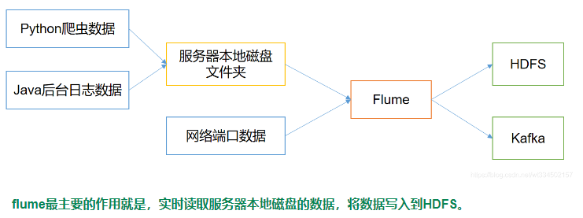
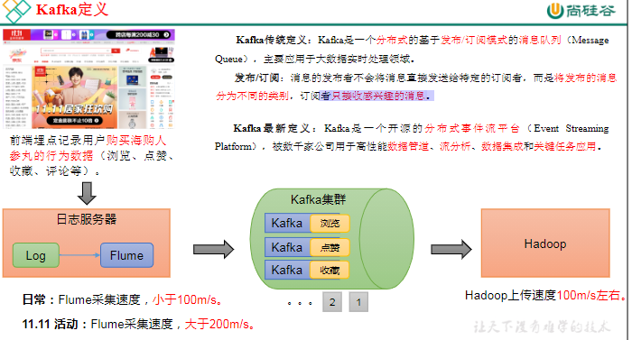

###  方案选型

大数据需要解决的三个问题：采集、存储、计算

#### Flume

是一个分布式的、可靠的、高可用的大数据采集系统，它可以将数据从不同的数据源（如Web服务器、日志文件、消息队列等）采集到Hadoop等大数据处理平台中进行处理和分析

数据源可基于文件、基于目录、基于TCP\UDP端口、基于HTTP、Kafka等采集 

三大组件:

- Source：数据源
- Channel：临时存储数据的管道
- Sink：目的地

#### kafka

是分布式事件流平台，用于高性能数据管道，流分析，数据集成和关键任务应用。

在大数据场景主要采用 Kafka 作为消息队列

因为高的吞吐量和低延迟
 

#### hadoop  

HA（High Availablity）高可用,分布式存储和计算的[开源软件](https://so.csdn.net/so/search?q=开源软件&spm=1001.2101.3001.7020)框架，适合处理大规模数据。、

Hadoop 三大核心组件:

- **HDFS**（分布式文件系统） -—— 实现将文件分布式存储在集群服务器上
- **MAPREDUCE**（分布式运算编程框架） —— 实现在集群服务器上分布式并行运算
- **YARN**（分布式资源调度系统） —— 帮用户调度大量的 MapReduce 程序，并合理分配运算资源（CPU和内存）.2.x增加

优点：高容错性，适合处理大数据，可构建在廉价机器上，通过多副本机制，提高可靠性

缺点：不适合低延时数据访问，比如毫秒级的存储数据，是做不到的；无法高效的对大量小文件进行存储；不支持并发写入、文件随机修改

##### hive

基于 Hadoop 的一个数据仓库工具，将结构化的数据文件映射为一张表，并提供类 SQL(HQL)查询功能。

是离线数仓，只支持导入和查询，一种类SQL的引擎，并且运行MapReduce任务

Hive 处理的数据存储在 HDFS

Hive 分析数据底层的实现是 MapReduce

执行程序运行在 Yarn 上

优点: 避免了去写 MapReduce，减少开发者的学习成本

优势在于处理大数据，在处 理 小 数 据 时 没 有 优 势 ， 因 为Hive 的执行延迟较高。

缺点: 数 据 挖 掘 方 面 不 擅 长 （ 多 个 子 查 询 ）,效率更高的算法却无法实现;

hive 分析的数据是存储在 HDFS 上的，而 HDFS仅支持追加写，所以在 hive 中不能 update 和delete，只能 select 和 insert。

##### hbase

HBase 是一种分布式、可扩展、支持海量数据存储的 NoSQL 数据库。

是一种在Hadoop之上的NoSQL 的Key/vale列式存储数据库

支持增删改查

#### spark 

是分布式计算平台,用scala语言编写的,基于内存的快速、通用、可扩展的大数据分析计算引擎

与hadoop区别:

Spark对标于Hadoop中的计算模块MR，但是速度和效率比MR要快得多；Spark数据处理速度秒杀Hadoop中MR；

Spark没有提供文件管理系统

Spark可以使用基于HDFS的HBase数据库，也可以使用HDFS的数据文件，还可以通过jdbc连接使用Mysql数据库数据； 

#### flink

Flink就是为实时计算而设计的，Flink可以同时实现批处理和流处理，Flink将批处理（即有有界数据）视作一种特殊的流处理。

Flink具有低延迟的特点,Spark的批处理模式通常具有较高的延迟，因为它需要等待所有数据到达后才能进行处理。虽然Spark也支持流处理，但是其流处理模式是基于微批处理的，即将数据分成小的批次进行处理，因此会有一定的延迟。

Flink中提供了3个组件，包括DataSource、Transformation和DataSink

1.DataSource：表示数据源组件，主要用来接收数据，目前官网提供了readTextFile、socketTextStream、fromCollection以及一些第三方的Source。
2.Transformation：表示算子，主要用来对数据进行处理，可以将数据流转换成另一个数据流或者聚合成一个数据流，转换算子可以将一个数据流转换成另一个数据流，聚合算子则可以将多个数据流聚合成一个数据流。常用的算子有map、filter、flatMap、keyBy、reduce、window等。这些算子可以被组合在一起形成复杂的数据处理任务
3.DataSink：表示输出组件，主要用来把计算的结果输出到其他存储介质中，比如writeAsText以及Kafka、Redis、Elasticsearch等第三方Sink组件。
