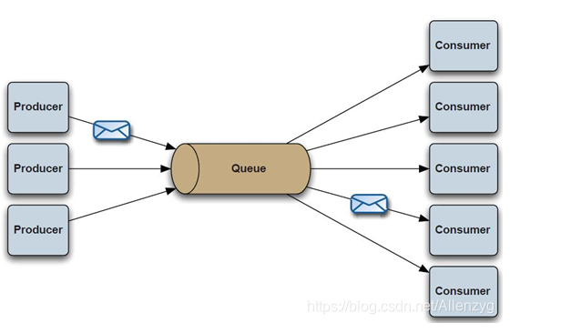
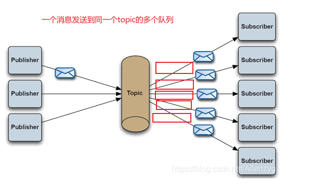

# MQ

## 消息队列模式分类

### 点对点 

PTP点对点:使用queue作为通信载体

消息生产者生产消息发送到queue中，然后消息消费者从queue中取出并且消费消息。 Queue支持存在多个消费者，但是对一个消息而言，只会有一个消费者可以消费。

### 发布/订阅（广播BROADCAST）

Pub/Sub发布订阅（广播）：使用topic作为通信载体

消息生产者（发布）将消息发布到topic中(同一个topic的多个队列)，同时有多个消息消费者（订阅）消费该消息。和点对点方式不同，发布到topic的消息会被所有订阅者消费。

