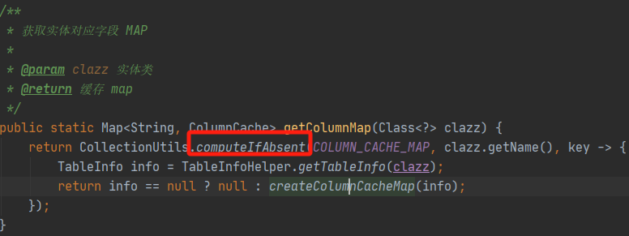

# java基础
## 面向对象和面向过程
面向对象:把一个个复杂的问题，抽象成了一个个对象，这个对象有自己的属性，有自己的方法。然后再通过不同对象的方法调用，来达到计算目的
面向过程:定义一个个的方法，将数据集扔进去，加工成新的数据集返回
比如计算圆很长方形面积，面向过程直接定义2个静态方法分别计算。而面向对象，可以建圆类和长方形类 集成 抽象形状类 重写 计算面积 的抽象方法 

## 封装继承多态
封装目的:通过权限修饰符实现隐藏内部细节，避免外部修改。
继承:子类继承父类复用
多态:允许基类的指针指向派生类对象，并调用基类或派生类方法父类 
    多态通过重载和重写实现

## 权限修饰符
default:属性或方法可以被同一包内类或子类访问。修饰符用于指定接口中的方法为默认方法。默认方法允许在接口中定义具有方法体的方法
protected: 属性或方法可以被同一包内类或子类访问
private: 当前类可见
public:都可见

## 接口和抽象类有什么区别
1定义的关键字不同：abstract和interface。
2子类继承或实现关键字不同：extends和implements。
3类型扩展不同：抽象类是单继承，而接口是多实现。
4方法访问控制符：抽象类无限制，只是抽象类中的抽象方法不能被 private 修饰；而接口有限制，接口默认的是 public 控制符。
5成员属性：抽象类可以有成员变量，而接口只能有常量。 
总结一下，接口更多的是定规范，实现了这个接口，就代表你有什么功能。
          而抽象类更多的是抽取和复用。所以`抽象类可以编写统一的代码，模板，比如我们的模板方法模式，骨架都是用抽象类搭的`。

### 接口为啥要有default方法
1.8开始接口可以有default方法，里面必须有实现。default 方法也被称之为守护方法（defender method）或者虚拟扩展方法（virtual extension method）。可以在接口中包含一些默认的包含方法体的方法，从而使得接口在进行扩展的时候，不会破坏它的实现类，从而更好的实现开闭原则。

## final修饰符
final不可变，目的为了缓存复用(比如Integer相同值指向相同对象,基本数据的包装类都是final修饰)，为了常量池，再就是线程安全.

## 反射
运行时获取类信息
反射慢原因:运行时解析而非编译(比如获取字段或方法是动态循环匹配)，私有成员访问的安全性检查开销， 
反射慢优化:能不用就不用,非要用可以优化缓存耗时操作，缓存class对象和method对象。
mybatisPlus需要用到大量的反射，提前缓存了类的所有字段LambdaUtils

### 获取Class的几种方式
-  使用.class语法
- 调用对象的getClass()方法
- 使用Class.forName()方法
- 使用ClassLoader的loadClass()方法

## ArrayList和LinkedList的区别
数据结构：最大的差别就是底层的数据结构，一个是动态数组，一个是双向链表。
随机访问性能：arraylist支持随机下标访问时间复杂度O（1），而linkedlist哪怕是随机访问，也得从头开始遍历，时间复杂度0（n）。
插入和删除操作性能：arraylist在增删的时候，需要移动后方元素的位置，时间复杂度O（n），linkedlist在任意位置增删只需要修改节点指针，O（1）。

## HashMap
数据结构： 哈希表 ，即数组+链表 / 红黑树 

当我们往HashMap中put元素时，利用key的hashCode重新hash计算出当前对象的元素在数组中的下标

存储时，如果出现hash值相同的key，此时有两种情况。
a. 如果key相同，则覆盖原始值；
b. 如果key不同（出现冲突），则将当前的key-value放入链表或红黑树中
获取时，直接找到hash值对应的下标，在进一步判断key是否相同，从而找到对应值。
   
1.8尾插法，数据结构：链表+数组+红黑树
ConcurrentHashMap  1.7是分段锁，用lock。1.8对每个node加锁，用synchronize+cas。
1.8大体流程就是，如果table数组位置没值，用cas替换，如果有值，加锁插入。

## HashSet 的实现原理？

HashSet是基于HashMap实现的，HashSet底层使用HashMap来保存所有元素，因此HashSet的操作相对比较简单，相关HashSet的操作，基本上都是直接调用底层的HashMap的相关方法来完成，HashSet不允许有重复的值，并且元素是无序的
## ConcurrentHashMap
保证并发，最重要的就是锁，但是锁会影响并发的效率。那么优化点就是，锁的粒度设计 
jdk1.8 版本中，对 ConcurrentHashMap 做了优化，取消了分段锁的设计，取而代之的是通过 cas 操作和 synchronized 关键字来实现优化

## 异常
不正常（可以被抛出throws）的类都继承于Throwable。
Throwable底下有两大类，异常（Exception）和错误（Error）。
错误（Error）类：通常是由于系统故障或资源耗尽等严重问题引起的，一般我们不去捕获它，捕获了也没法处理。比如：
●OutOfMemoryError：内存耗尽错误。
●StackOverflowError：堆栈溢出错误等。

异常用try-catch捕获,finally 块通常用于确保资源得到释放或清理工作
###  finally一定会执行吗？
理论上try后的语句，就一定会让finally执行。但是try中的代码和finally的代码，并不构成原子性。你如果想用finally来做事务，就大错特错了。它有几个失效场景。
1程序崩溃：try或catch执行的时候，程序突然宕机，或者代码块主动调用了System.exit()方法。
2无限循环：try或者catch语句出现了无限循环，永远都走不到finally。
3finally异常：finally代码块处理的时候又抛出了异常，导致异常后的代码不会被执行。