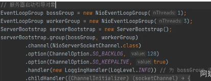

 # 八股文  
### websocket 协议
HTTP是一种无状态的协议，每次请求都需要建立一个新的连接
WebSocket是一种全双工的协议，有状态的双向连接，是持久连接，

### netty的线程模型？
netty的线程模型就是经典的reactor模型，底层基于io多路复用（select，poll，epoll三种实现）。reactor模型又分为单线程，多线程，主从reactor。这个去看看具体描述。这几种模式在netty中都有可能会出现，主要看你代码怎么配置。

我们通常的使用姿势，是用主从reactor模型，用单独的主reactor线程来处理连接的事件，用从reactor线程来处理io读写事件，来达到极致的性能。

### **netty为什么用堆外内存？**

java实现堆外内存的方法，可以用DirectByteBuffer来实现，它会申请一个堆外内存。堆外内存不由jvm管理，不会进行垃圾回收，同样在数据传输的时候，不需要经过用户态》内核态》网卡的步骤，内核态和用户态都指向这片内存空间，减少拷贝次数。
优点：
1不参与垃圾回收，不会占用每次垃圾回收器的扫描，清理时间。
2减少用户态到内核态的拷贝，提升效率。
缺点：
1堆外内存比较难控制和管理，产生内存泄漏很难排查到。