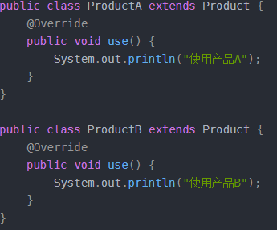
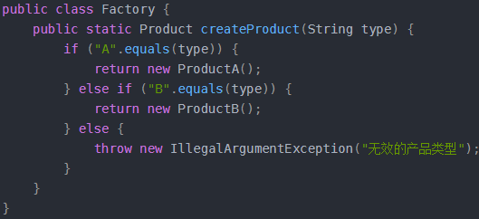
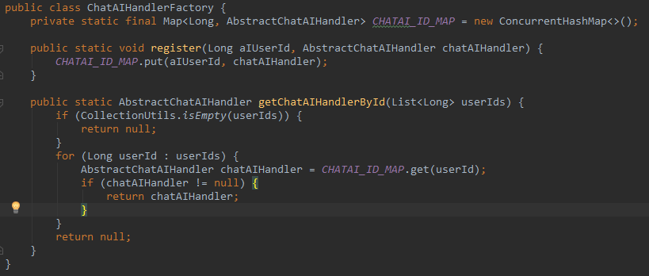
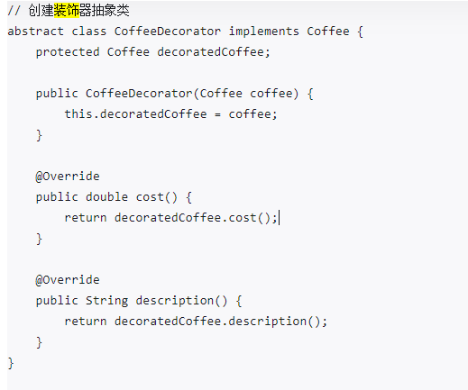
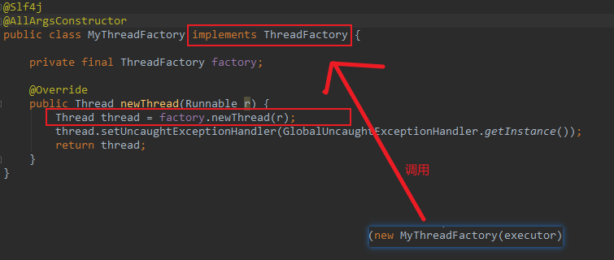
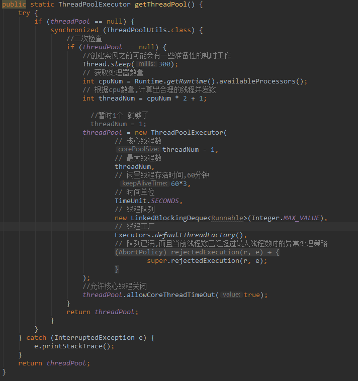
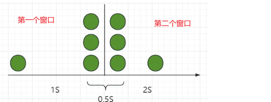
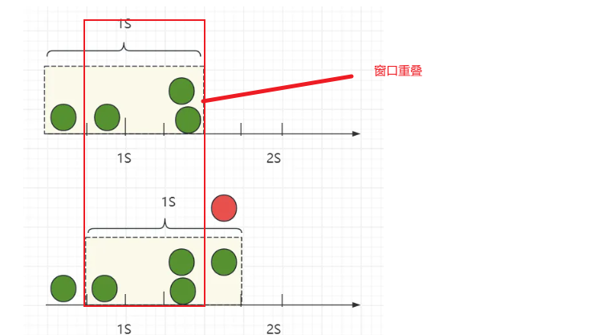
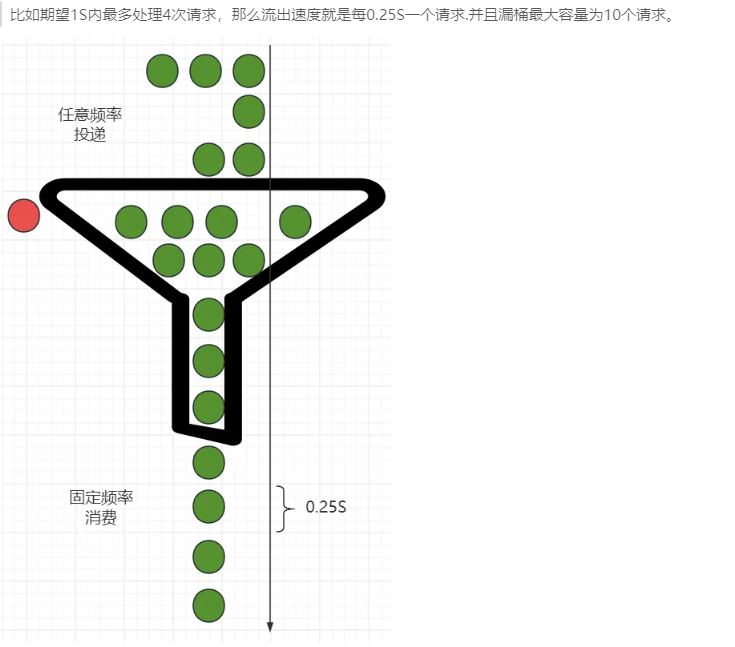
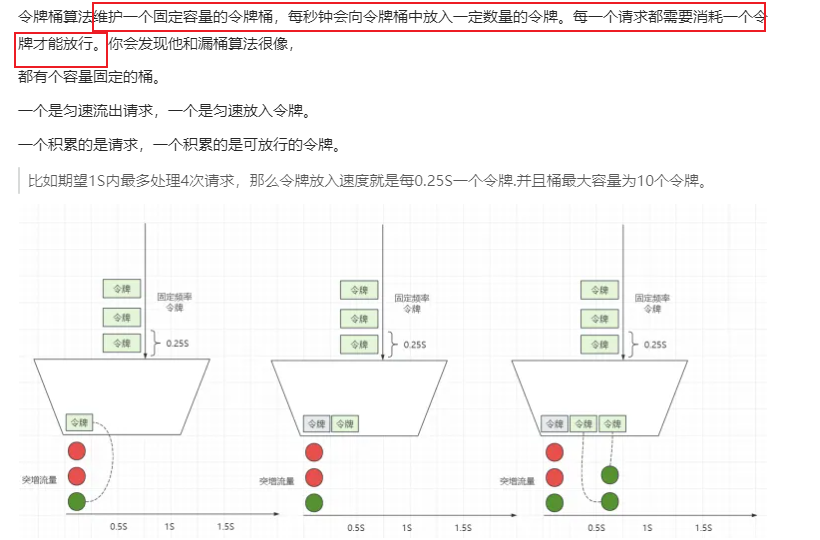

# 设计模式

https://blog.csdn.net/qq_45649807/article/details/124593629#6_184

## 创建型设计模式：

- 简单工厂：用来生产同一等级结构中的任意产品。（不支持拓展增加产品）

  2个不同的产品类 继承 抽象产品类，由工厂类决定创建哪个对象

  

具体应用：
 

- 工厂方法（又称多态性工厂模式）：用来生产同一等级结构中的固定产品。（支持拓展增加产品）

  多个工厂类继承抽象工厂，实现创建对象的方法，由工厂子类去创建具体的对象，生成对应的产品

  

- 抽象工厂： 用来生产不同产品族的全部产品。（不支持拓展增加产品；支持增加产品族）

  和工厂方法一样，只不过可以创建不同类型的产品。比如既可以生产车吗，又可以生产引擎。

  

## 结构型

### 装饰者模式

通过创建一个装饰类来 包装（实现）原始类。装饰类具有与原始类相同的接口，在装饰类中调用原始类的方法，可以在方法中包装额外的功能



# 线程

## 统一管理项目的线程池

频繁的创建、销毁线程和线程池，会给系统带来额外的开销。未经池化及统一管理的线程，则会导致**系统内线程数上限不可控**。

- 使用单例模式

 

- 自建线程池交给spring管理

```java
@Configuration
@EnableAsync
public class ThreadPoolConfig implements AsyncConfigurer {
    /**
     * 项目共用线程池
     */
    public static final String MALLCHAT_EXECUTOR = "mallchatExecutor";
    /**
     * websocket通信线程池
     */
    public static final String WS_EXECUTOR = "websocketExecutor";

    @Override
    public Executor getAsyncExecutor() {
        return mallchatExecutor();
    }

    @Bean(MALLCHAT_EXECUTOR)
    @Primary
    public ThreadPoolTaskExecutor mallchatExecutor() {
        ThreadPoolTaskExecutor executor = new ThreadPoolTaskExecutor();
        executor.setCorePoolSize(10);
        executor.setMaxPoolSize(10);
        //优雅停机,不设置的化好像也可以，spring处理了的
        executor.setWaitForTasksToCompleteOnShutdown(true);
        executor.setQueueCapacity(200);
        executor.setThreadNamePrefix("mallchat-executor-");
        executor.setRejectedExecutionHandler(new ThreadPoolExecutor.CallerRunsPolicy());//满了调用线程执行，认为重要任务
        executor.setThreadFactory(new MyThreadFactory(executor));
        executor.initialize();
        return executor;
    }
}


/**
* 装饰者模式-线程的异常捕捉
**/
@Slf4j
@AllArgsConstructor
public class MyThreadFactory implements ThreadFactory { 
    private final ThreadFactory factory; 
    @Override
    public Thread newThread(Runnable r) {
        Thread thread = factory.newThread(r);
        thread.setUncaughtExceptionHandler(GlobalUncaughtExceptionHandler.getInstance());
        return thread;
    }
}


@Slf4j
public class GlobalUncaughtExceptionHandler implements Thread.UncaughtExceptionHandler { 
    private static final GlobalUncaughtExceptionHandler instance = new GlobalUncaughtExceptionHandler(); 
    private GlobalUncaughtExceptionHandler() {
    } 
    @Override
    public void uncaughtException(Thread t, Throwable e) {
        log.error("Exception in thread {} ", t.getName(), e);
    } 
    public static GlobalUncaughtExceptionHandler getInstance() {
        return instance;
    } 
}


```

使用：


## 线程池

ThreadPoolExecutor

a。继承了ExecutorService的普通类,这是JDK线程池的核心实现。

b。它的构造器提供了各种可配置参数,比如线程数量、任务队列、拒绝策略等，方便我们自定义自己的线程池，以及各种钩子 (hook) 方法，方便追踪线程任务的执行，这是我们学习的重点。 

线程池参数：

```
* corePollSize核心线程池大小 : 活动线程在 队列未满的情况下  一直在核心线程数内处理任务 ；核心线程会一直存活，即使没有任务需要处理。当线程数小于核心线程数时，即使现有的线程空闲，线程池也会优先创建新线程来处理任务，而不是直接交给现有的线程处理。
* maximumPoolSize最大线程池大小:线程池允许的最大线程数，BlockingQueue满了，当线程池中的线程数< 最大线程数时，当有新的任务到来时，会继续创建新的线程去处理
* keepAliveTime线程空闲时间: 当线程池中空闲线程数量超过了核心线程数时，多余的线程会在多长时间内被销毁
* workQueue阻塞工作队列:任务队列，被添加到线程池中，但尚未被执行的任务；
     i.ArrayBlockingQueue: 有界阻塞任务队列，构造函数一定要传入具体队列容量
     ii.LinkedBlockingQueu: 通常作为无界阻塞任务队列 (构造函数不传大小会默认为IntegerMAX VALUE ) ，当有大量任务提交时，容易造成内存耗尽
     iii.SynchronousQueue: 一个没有容量的阻塞队列，会将任务同步交付给工作线程.
     iv.PriorityBlockingQueue: 具有优先级的无界阻塞任务队列。
* handle任务拒绝策略:当任务超过了线程工作队列时，对任务的拒绝策略
     a对于正在执行的线程数等于maxmumPoolSize以及workQueue容量已满时提交的任务，或者线程池正在关闭时的新提交的任务，线程池将会执行拒绝策略，即这些任务都      直接被非线程池线程处理了。bThreadPoolExecutor中提供了4种拒绝策略的实现:
        i.AbortPolicy: 调用者的线程直接抛出异常，作为默认拒绝策略:
        ii.CallerRunsPolicy: 用调用者的线程执行任务:
        iii.DiscardOldestPolicy: 抛弃队列中最久的任务:
        iv.DiscardPolicy: 抛弃当前任务;
        v. 当然，我们还能够实现 RejectedExecutionHandler ，方法自行实现拒绝策略。就比如阿斌公司w用线程池来控制并发，但是希望满了后不丢弃，而是将主线程             阻塞着，等到队列里放得下，再放进去。这个场景比较特殊，是mq，本来就是背压式的消费，所以可以阻塞住。
* threadFactory : 线程工厂用于创建工作线程，默认线程工厂: Executors.defaultThreadFactory。
                  a我们经常在里面设置线程前缀，还可以做包装，比如执行前后做一些动作.
* unit:keepAliveTime线程空闲时间的时间单位                 

```


ScheduledThreadPoolExecutor
a。继承了ThreadPoolExecutor的普通类，可以看作功能的扩展或增强
b，它能够将线程任务延迟指定时间后执行，或者间隔固定时间多次执行。功能与Timer类似，但ScheduledThreadPoolExecutor功能更强大，更灵活。Timer对应的是单个后台线程，而ScheduledThreadPoolExecutor可以在构造函数中指定多个对应的后台线程数。Timer中一个任务出现异常之后会影响其他任务的执行，但是ScheduledThreadPoolExecutor不会。Timer中一个任务耗时较常会影响其他任务的执行，ScheduledThreadPoolExecutor不会。

Executors
a.独立出来的一个普通类(没有继承和实现关系，采用组合/聚合关系，图上没有注明)，作为一个线程池工厂，提供各种实用方法。
b.提供了各种预定义线程池的实现，比如CachedThreadPool、FixedThreadPoo等:提供了将Runnable包装、转换为Callable的方法，提供默认的ThreadFactory线程工厂的实现等功能。

#### 引出的面试问题：

1. 你是如何做线程池统一管理的（引出你对线程池参数的理解）
2. 你是如果做优雅停机的（可自己写，也可使用spring自带线程池，项目都用到了）
3. 你是如何做异常捕获日志打印，更好的监控线程运行的？
4. 你又是如何查看spring线程池源码，用装饰器更优雅去添加异常捕获功能的（引出你对源码，设计模式的理解）

# 锁

## 从特性角度

### 可重入锁（Reentrant Lock/Synchronized）

 指的是同一个线程可以多次获得同一个锁，而不会因此发生死锁指的是同一个线程可以多次获得同一个锁，而不会因此发生死锁,统一线程外层函数获得锁之后，内层递归函数仍然能获取该锁的代码。简单来说，如果一个线程已经获得了某个锁，那么在持有锁的情况下，可以再次获得相同的锁，而不会被自己所持有的锁所阻塞

可重入锁最大的作用是避免死锁

```java
@SneakyThrows
public void ReentrantLock(String id) {
    RLock lock = redissonClient.getLock(  "ssssss:" + id);
    boolean lockSuccess = lock.tryLock(-1,TimeUnit.SECONDS);
    if(!lockSuccess){
        log.debug("获取锁失败");
        throw new ServiceException("获取锁失败");
    }
    log.info(id);
    try {
        Thread.sleep(10000);
    } catch (InterruptedException e) {
        e.printStackTrace();
    }finally {
        lock.unlock();
    }
    log.info("结束");
}
```

### 公平锁 (Fair Lock)

公平锁（Fair Lock）是一种锁机制，它``按照请求锁的顺序来分配锁，以确保资源的公平分配``。换句话说，公平锁保证线程按照它们发出请求的顺序来获取锁，不会因为线程调度的不确定性而导致某些线程永远无法获取到锁

```java
new ReentrantLock(true); 就可以
```

### 自旋锁

相比可重入锁来说适用于锁竞争不激烈的情况，在非常小的临界区域内使用，当线程在获取锁时通常能够快速成功，``避免了线程切换的开销``。

### 读写锁(ReentrantReadWriteLock)

它允许多个线程同时读取共享资源，但只允许一个线程写入共享资源。它的特点是可重入性，即同一个线程可以多次获取同一把锁，同时还支持读写锁分离的功能

相比于使用普通的互斥锁来控制读写操作，使用 ReentrantReadWriteLock 的好处在于它允许多个线程同时进行读操作，从而提高了读取性能。但是，由于需要维护读写锁之间的状态，因此在实现上可能会比简单的互斥锁更复杂，同时也可能存在一些性能开销。


public class MyCache {

```java
private volatile Map<String,Object> map = new HashMap<>();
private ReentrantReadWriteLock rwLock = new ReentrantReadWriteLock();

public void put(String key,Object value){

    rwLock.writeLock().lock();

    try {

        System.out.println(Thread.currentThread().getName() + " \t 正在写入" + key);
        try {
            TimeUnit.MICROSECONDS.sleep(300);
        } catch (InterruptedException e) {
            e.printStackTrace();
        }
        map.put(key, value);
        System.out.println(Thread.currentThread().getName() + "\t 写入完成");

    }catch (Exception e){

    }finally {
        rwLock.writeLock().unlock();
    }
}

public void get(String key){
    rwLock.readLock().lock();

    try {

        System.out.println(Thread.currentThread().getName() + " \t 正在读取" + key);
        try {
            TimeUnit.MICROSECONDS.sleep(300);
        } catch (InterruptedException e) {
            e.printStackTrace();
        }
        Object result = map.get(key);
        System.out.println(Thread.currentThread().getName() + "\t 读取完成" + result);

    }catch (Exception e){

    }finally {
        rwLock.readLock().unlock();
    }
}
```

}

### 信号量

信号量主要用于两个目的：一个是用于多个共享资源的互斥使用，另一个用于并发线程数的控制

```java
public class SemaphoreDemo {
    public static void main(String[] args) {
        Semaphore semaphore = new Semaphore(3);//模拟3个停车位
        for(int i = 0; i <= 6; i++){ //模拟6辆汽车
            new Thread(()->{
                try {
                    semaphore.acquire();

                System.out.println(Thread.currentThread().getName() + "抢到停车位");
                try {
                    TimeUnit.SECONDS.sleep(3);
                } catch (InterruptedException e) {
                    e.printStackTrace();
                }
                System.out.println(Thread.currentThread().getName() + "停车3秒后离开车位");
                } catch (InterruptedException e) {
                    e.printStackTrace();
                }finally {
                    semaphore.release();
                }
            },String.valueOf(i)).start();

        }
    }
}

```

### 闭锁（CountDownLatch） 

CountDownLatch：让一些线程阻塞直到另一些线程完成一系列操作后才被唤醒。

```
public class CountDownLatchDemo {

    public static void main(String[] args) throws InterruptedException {
        CountDownLatch countDownLatch = new CountDownLatch(5);
        for(int i = 1; i <= 5; i++){
            new Thread(()->{
                countDownLatch.countDown();
                System.out.println(Thread.currentThread().getName() + "朝灭亡");
            },CountryEnum.forEach_CountryEnum(i).getRetMessage()).start();
        }
        countDownLatch.await();  //当减为0的时候，被阻止的主线程才能被使用
        System.out.println(Thread.currentThread().getName() + "朝");
    }
}

```

```
public enum CountryEnum {

    ONE(1,"唐"),TWO(2,"宋"),THREE(3,"元"),FOUR(4,"明"),FIVE(5,"清");

    @Getter
    private Integer retCode;
    @Getter
    private String retMessage;

    CountryEnum(Integer retCode,String retMessage){
        this.retCode = retCode;
        this.retMessage = retMessage;
    }

    public static CountryEnum forEach_CountryEnum(int index){
        CountryEnum[] myArray = CountryEnum.values();
        for(CountryEnum element : myArray){
            if(index == element.getRetCode()){
                return element;
            }
        }
        return null;
    }
}

```


## 从读写角度

### 独占锁（写锁）

独占锁：指该锁一次只能被一个线程所持有。ReentrantLock和Synchronized都是独占锁

```
ReentrantReadWriteLock lock = new ReentrantReadWriteLock();
lock.readLock().lock(); // 获取读锁
```


### 共享锁（读锁）

指该锁可被多个线程所持有

```
ReentrantReadWriteLock lock = new ReentrantReadWriteLock();
lock.readLock().lock(); // 获取读锁
```


### 互斥锁

确保同一时间只有一个线程可以进入同步代码块或同步方法，如synchronized，ReentrantLock


# 限流

一般来说系统的吞吐量是可以被测算的，为了保证系统的稳定运行，一旦达到的需要限制的阈值，就需要限制流量并采取一些措施以完成限制流量的目的。比如：延迟处理，拒绝处理，或者部分拒绝处理等等。

## 固定窗口(计数器)

每秒作为一个时间窗口，设置每个时间窗口不能超过4个请求

**临界点问题**。当切换窗口的时候，所有计数将会重新计数，就会出现短短0.5秒内达到6个请求的情况；如果请求集中在两个窗口之间。那么请求次数可能会超过我们的预期，最高达到预期的两倍


适用于平常流量相对均匀分布，比如签到和二维码获取接口（每个人每天请求二维码不超过20次。超过就认为是小黑子，直接限流）


## 滑动窗口

解决临界点问题，就是窗口重叠
 

 

滑动窗口最大`优点`是平滑。能够允许**偶尔突发**的请求，但是会**限制**窗口内的**总次数**，适合需要保证平均速率的场景。`缺点`是他需要保存窗口内**每个请求**的时间分布状态，比较占用内存。真是因为这样的状态``滑动窗口最好是用于全局的限流``

如果用于用户级别的限流，那就会为每一个用户都创建一个滑动窗口，比较消耗内存。

适用：**api限流**和**sentinel限流框架底层**

## 漏桶

无论你以什么样的**不确定频率**去添**加水**。水都会从底部以**固定的频率流出**，其余的水蓄在漏桶中，直到漏桶满了被丢弃。



漏桶限流算法最大的特点就是**流量整型**。让不规则的请求频率，转为规则的频率进行消费。

**优点**：

可以严格限制请求的处理速度，避免瞬间请求过多导致系统崩溃或者雪崩。

**缺点**：

- 需要对请求进行缓存，会增加服务器的内存消耗。
- 面对突发流量的时候，优点同时也会是缺点。无法适应瞬时的突增流量。

适用：

   流量整型，超级**严格的限制流出的速率**,漏桶比较适合后台任务的限流，或者客户端限流。比如 **家庭带宽20M限制**

不适合C端接口的限流。因为对于都到了限流的场景了。并发已经比较高了。我们希望的是超过限制的请求，立马就给他快速失败返回了，而不是hold在桶里休眠等待响应。这样整体的RT会很高，同时还占用我们的请求连接池。

## 令牌桶

其实和漏桶算法的效果是一样的。最大的差别就是在请求不多的时候，它能**存储令牌**，用来应对**突增流量**





适用:

更加适合应对突发的流量。流量达到极限后，就会退化成没桶的漏桶，速率变成了严格控制。适用于流量整体平滑的情况下，同时也可以满足一定的突发流程场景

缺点，就是他的预热问题。刚创建的令牌桶，这时候没有令牌，请求刚进来，又由于它没有桶，直接就把请求丢弃了。


## 总结

令牌桶更能够扛波动，而漏桶完全固定速率。

- `固定窗口`：实现简单，适用于流量相对均匀分布，对限流准确度要求不严格的场景。
- `滑动窗口`：适用于对准确性和性能有一定的要求场景，能够控制平均的速率。
- `漏桶`：适用于固定速率处理请求
- `令牌桶`：适用于控制精确速率，同时也可以满足一定的突发流量场景

## 工作中的使用

### spring cloud gateway


- spring cloud gateway 默认使用 redis 进行限流，笔者一般只是修改修改参数属于拿来即用，并没有去从头实现上述那些算法。

```
<dependency>
    <groupId>org.springframework.cloud</groupId>
    <artifactId>spring-cloud-starter-gateway</artifactId>
</dependency>
<dependency>
    <groupId>org.springframework.boot</groupId>
    <artifactId>spring-boot-starter-data-redis-reactive</artifactId>
</dependency>
```


```
spring:
    cloud:
        gateway:
            routes:
                - id: requestratelimiter_route

                  uri: lb://pigx-upms
                  order: 10000
                  predicates:
                      - Path=/admin/**

                  filters:
                      - name: RequestRateLimiter

                        args:
                            redis-rate-limiter.replenishRate: 1 # 令牌桶的容积
                            redis-rate-limiter.burstCapacity: 3 # 流速 每秒
                            key-resolver: '#{@remoteAddrKeyResolver}' #SPEL表达式去的对应的bean

                      - StripPrefix=1
```


```
@Bean
KeyResolver remoteAddrKeyResolver() {
    return exchange -> Mono.just(exchange.getRequest().getRemoteAddress().getHostName());
}
```


### sentinel


- 通过配置来控制每个 url 的流量

```
<dependency>
    <groupId>com.alibaba.cloud</groupId>
    <artifactId>spring-cloud-starter-alibaba-sentinel</artifactId>
</dependency>
```


```
spring:
    cloud:
        nacos:
            discovery:
                server-addr: localhost:8848
        sentinel:
            transport:
                dashboard: localhost:8080
                port: 8720
            datasource:
                ds:
                    nacos:
                        server-addr: localhost:8848
                        dataId: spring-cloud-sentinel-nacos
                        groupId: DEFAULT_GROUP
                        rule-type: flow
                        namespace: xxxxxxxx
```


- 配置内容在 nacos 上进行编辑

```
[
    {
        "resource": "/hello",
        "limitApp": "default",
        "grade": 1,
        "count": 1,
        "strategy": 0,
        "controlBehavior": 0,
        "clusterMode": false
    }
]
```


- resource：资源名，即限流规则的作用对象。
- limitApp：流控针对的调用来源，若为 default 则不区分调用来源。
- grade：限流阈值类型，QPS 或线程数模式，0 代表根据并发数量来限流，1 代表根据 QPS 来进行流量控制。
- count：限流阈值
- strategy：判断的根据是资源自身，还是根据其它关联资源 (refResource)，还是根据链路入口
- controlBehavior：流控效果（直接拒绝 / 排队等待 / 慢启动模式）
- clusterMode：是否为集群模式

### 总结


> sentinel 和 spring cloud gateway 两个框架都是很好的限流框架， 但是在我使用中还没有将[spring-cloud-alibaba](https://github.com/alibaba/spring-cloud-alibaba)接入到项目中进行使用， 所以我会选择**spring cloud gateway**， 当接入完整的或者接入 Nacos 项目使用 setinel 会有更加好的体验.