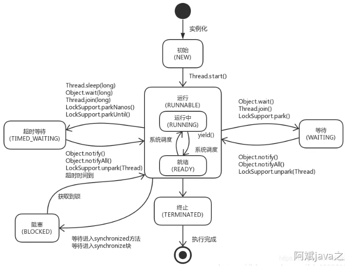

# 锁
# 线程
## 操作系统的线程
5种，创建->就绪(等待系统调度获得cpu时间片)<->运行->(需要等待资源事件)阻塞->就绪
                                            运行->终止                                            

## java线程的6种状态:
新建
运行(cpu的就绪+运行):调用了start(),等待倍线程调度选中
阻塞: 线程阻塞于同步锁
等待: 等待其他线程做动作(通知或中断)
超时等待:timed_wating
终止

thread.sleep 会当前线程进入超时等待状态，不释放对象锁，时间完成后自动进入就绪状态。 作用:给其他线程执行机会的最佳方式

# ThreadLocal
ThreadLocal  本地线程变量，ThreadLocal为变量在每个线程中都创建了一个副本，每个线程可以访问自己内部的副本变量，不存在多线程之间的共享问题。
通过源码可以看出，thread内部的ThreadLocalMap对象用entry结构存了所有的线程变量。它的key是个弱引用
弱引用就是每次gc回收，都会回收这个弱引用对象

如果忘记remove了。那么gc也会因为它是弱引用，主动移除它。 但是value还是占用着内存。我们通常说的内存泄漏，其实都是value的泄漏。

但是源码已经极大的减少的内存泄漏的可能性。去看源码可以发现，每次set值，remove值或者resize的时候，遍历到这些key=null的entry，都会主动移除里面的value。

# InheritableThreadLocal

InheritableThreadLocal是父子线程可继承的线程变量。它继承了ThreadLocal，重写了几个方法。 
使用InheritableThreadLocal可能会有几个问题需要注意。
1父子线程内线程变量的具体value值，是相同的引用。多个线程如果并发修改引用对象内的属性，可能会产生并发问题。
2父子继承存在于new Thread()构造方法中，在父线程进行的copy。如果用了线程池，可能线程是复用的导致传递失败。
使用场景 ：日常项目我们都是通过线程池来使用线程，和InheritableThreadLocal不是很兼容，所以感觉没啥使用场景，一般不用。