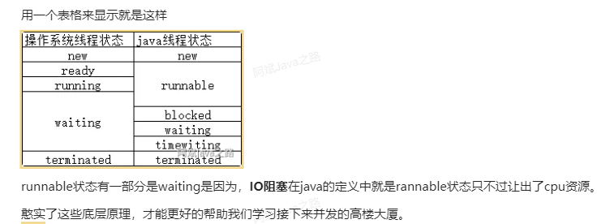
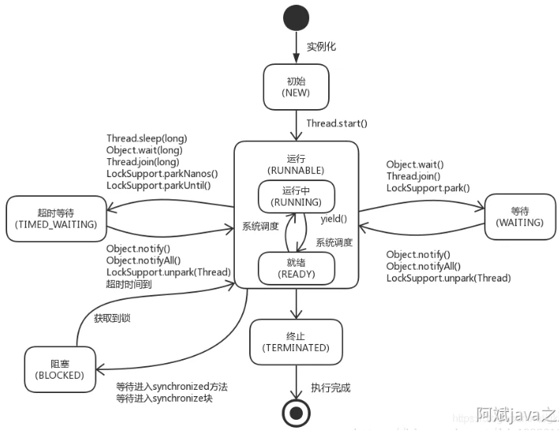
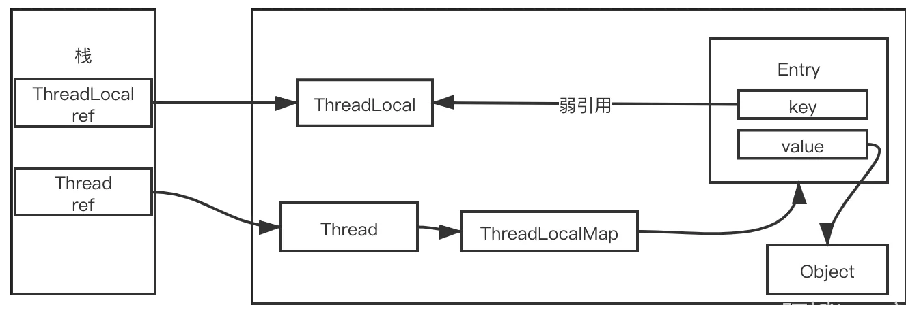
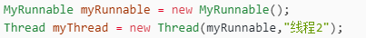
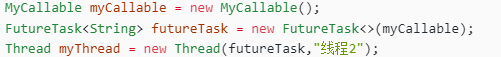
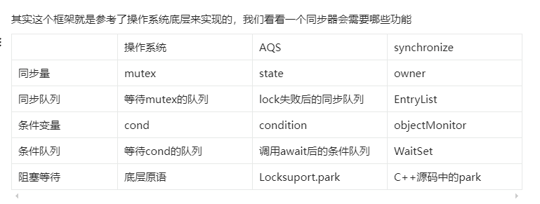

# 八股文 - 不旨在实用
 
### 什么是线程?
线程是进程中的一个执行单元，是CPU调度和分派的基本单位，，它被包含在进程之中，是系统进行资源分配和调度的一个独立单位


### 线程安全和线程不安全？
线程不安全：多个线程先后更改数据造成所得到的数据是脏数据
线程安全: 

### 操作系统的线程
面试:   5种，创建->就绪(等待系统调度获得cpu时间片)<->运行->(需要等待资源事件就会)阻塞->(等条件达成重新进入)就绪态等待调度 
                                                                                                运行->(线程运行结束或异常)终止                                            

### java线程的6种状态流转和api-面试:

1新建 New
2可运行Runnable(cpu的就绪+运行):

调用了start() 

时间片用完，调用yield()（以允许具有相同优先级的其他线程获得运行机会） 方法也会进入就绪

sleep()方法结束

其他线程 join() 结束
3阻塞blocked: 

线程已经被挂起，原因通常是它在等待一个“锁”，当尝试进入一个 synchronized 语句块/方法时，锁已经被其它线程占有，就会被阻塞

4等待waiting :  等待其它线程显式地唤醒，否则不会被分配 CPU 时间片. 

进入等待状态的方法:  Object.wait() 方法;Thread.join() 方法;LockSupport.park()

退出等待 状态的方法: Object.notify() / Object.notifyAll() ;

5限期等待:timed_wating

Thread.sleep() ，设置了 Timeout 参数的 Object.wait() 方法，Thread.join()，LockSupport.parkNanos() ，LockSupport.parkUntil()

6终止


其他详解:

“阻塞”与“等待”的区别：

（1）“阻塞”状态是等待着获取到一个排他锁，进入“阻塞”状态都是被动的，离开“阻塞”状态是因为其它线程释放了锁，不阻塞了；

（2）“等待”状态是在等待一段时间 或者 唤醒动作的发生，进入“等待”状态是主动的；

blocked状态竞争的是moniter锁比较特殊，所以jvm专门用了一个状态来标识，这三个阻塞状态底层对应的实际都是waiting。


thread.sleep 会当前线程进入超时等待状态，不释放对象锁，时间完成后自动进入就绪状态。 作用:给其他线程执行机会的最佳方式
thread.yield() 当前线程挂起,当前线程放弃获取的CPU时间片，但不释放锁资源，由运行状态变为就绪状态，让OS再次选择线程。作用：让相同优先级的线程轮流执行，但并不保证一定会轮流执行。实际中无法保证yield()达到让步目的，因为让步的线程还有可能被线程调度程序再次选中。Thread.yield()不会导致阻塞。该方法与sleep()类似，只是不能由用户指定暂停多长时间。
thread.join()/thread.join(long millis)，等待其他线程加入,当前线程里调用其它线程t的join方法，当前线程进入WAITING/TIMED_WAITING状态，当前线程不会释放已经持有的对象锁。线程t执行完毕或者millis时间到，当前线程一般情况下进入RUNNABLE状态，也有可能进入BLOCKED状态（因为join是基于wait实现的）。
obj.wait()，当前线程调用对象的wait()方法，当前线程释放对象锁，进入等待队列。依靠notify()/notifyAll()唤醒或者wait(long timeout) timeout时间到自动唤醒
obj.notify()唤醒在此对象监视器上等待的单个线程，选择是任意性的。notifyAll()唤醒在此对象监视器上等待的所有线程
LockSupport.park()/LockSupport.parkNanos(long nanos),LockSupport.parkUntil(long deadlines), 当前线程进入WAITING/TIMED_WAITING状态。对比wait方法,不需要获得锁就可以让线程进入WAITING/TIMED_WAITING状态，需要通过LockSupport.unpark(Thread thread)唤醒。


`面试问线程的状态就可以按照下图答:`







### 面试-**wait和sleep的区别**

都是用来将线程进入休眠状态的， 让出执⾏机会给其他线程，等到休眠时间结束后，线程进⼊就绪状态和其他线程⼀起竞争cpu的执⾏时间。
并且 sleep 和 wait 方法都可以响应 interrupt 中断（可中断）

wait() 方法是定义在 Object 类中的，它用于实现线程间的协调和通信。会释放锁,进⼊到⼀个和该对象相关的等待池,使得其他线程能够访问。必须synchronized 块结合使用，只有持有锁可以调用否则抛出

sleep() 方法属于 Thread 类，它被用于暂停当前线程的执行一段指定的时间，线程虽然进⼊休眠，但是对象的机锁没有被释放，其他线程依然⽆法访问这个对象。

```
synchronized (lock) {
            System.out.println("新线程获取到锁：" + LocalDateTime.now());
            try {
                // 休眠 2s
                lock.wait(2000);
                System.out.println("新线程获释放锁：" + LocalDateTime.now());
            } catch (InterruptedException e) {
                e.printStackTrace();
            }
        }
```

### 面试 - volatile关键字的作⽤？
使⽤volatile关键字修饰的变量，保证了其在多线程之间的可⻅性，即每次读取到volatile变量，⼀定是最新的数据。

### 面试-**同步锁Synchronized与Lock的区别，如何选择？**

Lock是一个接口，而Synchronized是关键字

Lock可以灵活的控制锁的粒度，Synchronized使用场景能锁住类、方法和代码块

Synchronized会自动释放锁，而Lock必须手动释放锁

Lock可以让等待锁的线程响应中断，可以非阻塞尝试获取锁，可以超时获取锁，而Synchronized不会，线程会一直等待下去。

### 守护线程

处理后台工作。如JDK垃圾回收线程

通过thread.setDeamon(true)来设置守护线程
守护线程经常用来执行后台任务，当jvm进程中没有任意一个非守护线程存活时，jvm就会退出。

 

### ThreadLocal

ThreadLocal  本地线程变量，ThreadLocal为变量在每个线程中都创建了一个副本，每个线程可以访问自己内部的副本变量，不存在多线程之间的共享问题。
通过源码可以看出，thread内部的ThreadLocalMap对象用entry结构存了所有的线程变量。它的key是个弱引用
弱引用就是每次gc回收，都会回收这个弱引用对象

如果忘记remove了。那么gc也会因为它是弱引用，主动移除它。 但是value还是占用着内存。我们通常说的内存泄漏，其实都是value的泄漏。

但是源码已经极大的减少的内存泄漏的可能性。去看源码可以发现，每次set值，remove值或者resize的时候，遍历到这些key=null的entry，都会主动移除里面的value。



### InheritableThreadLocal

InheritableThreadLocal是父子线程可继承的线程变量。它继承了ThreadLocal，重写了几个方法。 
使用InheritableThreadLocal可能会有几个问题需要注意。
1父子线程内线程变量的具体value值，是相同的引用。多个线程如果并发修改引用对象内的属性，可能会产生并发问题。
2父子继承存在于new Thread()构造方法中，在父线程进行的copy。如果用了线程池，可能线程是复用的导致传递失败。
使用场景 ：日常项目我们都是通过线程池来使用线程，和InheritableThreadLocal不是很兼容，所以感觉没啥使用场景，一般不用。

### 线程创建流程

实现runnable

继承thread

不管如何，创建线程的方式有很多，但是启动要调用start(),这个方法会调用start0()方法，这是个native方法。native方法是jni对底层c++代码进行调用的。







## 锁

### 操作系统锁

是通过互斥量mutex  ,条件变量 cond - 利用共享的全局变量就行同步的机制，为了防止竞争，和互斥锁一起使用

后面还有一个int数值cas

### java锁实现

主要2个

synchronized :同步锁，其锁标志存储在对象头的markWord中

AQS:抽象队列同步器，是构建 可重入锁Reentrantlock,和同步组件CountDownLatch的底层框架



### 面试-aqs原理

AbstractQueuedSynchronizer，抽象队列同步器。提供了同步的底层基础框架。然后有很多锁都继承了这个类。

这个类有几个关键属性：

state同步量，通过竞争这个修改值，来达到同步的效果。

同步队列，双向链表，竞争失败的线程在这里面等待。

条件队列，调用condition的api的时候，等待条件的线程会进入这个队列。

类提供了对外的几个方法，独占的和共享的acquire，和release。用来获取锁和释放锁。
同时需要子类实现的几个方法，独占和共享的tryAcquire和tryRelease。

### 面试-**cas和锁怎么选**

CAS 操作在低竞争环境中通常性能较好。然而，在高竞争情况下，多个线程同时尝试 CAS 可能会导致自旋次数增加，影响性能。

在竞争很多的情况下，可以用锁。这样竞争不到的线程不会一直占用cpu时间，可以进行阻塞等待。

### 面试-**java有哪些锁**

synchronized锁：最常用最简单的关键字锁，可以给对象加锁
ReentrantLock锁：是JDK提供的一种可重入锁，与synchronized锁相比，它提供了更强大的功能，如可中断锁、公平锁、多条件变量等。
ReadWriteLock锁：是JDK提供的一种读写锁，可以分离读访问和写访问，可以提高并发性能。
StampedLock锁：是JDK1.8新引入的一种乐观锁，对读写锁进行了升级，支持乐观读模式，避免写饥饿，适用于读多写少的场景。
Semaphore锁：可以控制同时访问共享资源的线程个数。，CountDownLatch锁可以使某个线程等待其他线程完成操作之后再执行。
CountDownLatch锁：可以使某个线程等待其他线程完成操作之后再执行。
CyclicBarrier锁：可以实现让一组线程互相等待共同到达某个状态之后再全部同时执行。

### 面试- **Reentrantlock的实现原理**

可重入锁，底层基础是aqs（可以把[aqs的原理](https://www.yuque.com/snab/java/rx2nn24rap3203h7#EwWZ9)介绍下）。通过继承aqs，重入锁实现了公平锁和非公平锁两个子类，提供了锁的基本能力。公平锁会去校验队列是否有值，有值就加锁失败，失败了它就会老老实实的去同步队列里面等待。非公平锁会用cas的方式去修改state的值，尝试加锁。

### 面试- **读写锁实现原理？**

读写锁的实现靠的也是aqs。它提供了读锁和写锁的不同实现的子类，复用一个sync同步器，读锁获取锁调用的是acquireShared，写锁获取锁调用的是aquire。aqs底层只有一个state同步量，为了精确的表示出读锁和写锁的持有情况，采用了 高16位为读锁，低16位为写锁的方式。


### 什么是乐观锁和悲观锁
 乐观锁: 在数据进⾏更新的时候，才会正式对数据的冲突与否进⾏检测,如果发现冲突了，则让返回⽤户错误的信息.(如mysql每次更新的时候会检测版本号)
 悲观锁：无论读和写，采⽤独占的⽅式来访问这些变量。(独占锁其实就是⼀种悲观锁，所以可以说synchronized是悲观锁)


  
## 并发工具

### ReentrantLock

ReentrantLock提供了公平锁和非公平锁


ReentrantLock有他的优点，也有他的缺点。很多场景，我们只是读数据，并不会去修改数据，其实没必要加上锁，只要读写互斥就行，读和读操作没必要互斥。

### 公平锁 

看看公平锁的tryAcquire就能了解他的逻辑，它非常老实，只要同步队列里面有节点在等待，它就会无法抢占锁，tryAcquire返回失败后呢，它就会老老实实的去同步队列里面等待

### 非公平锁

如果当前锁是空闲状态，允许该线程去根据cas抢占一次锁。丝毫没有考虑到同步队列里面可能会有节点在等待。毕竟里面的节点需要unpark唤醒速度明显会更慢。但是可能会产生锁饥饿的现象。毕竟一个是需要unpark唤醒的线程和一个已经在运行的线程抢锁，肯定是抢不过嘛！

### ReentrantReadWriteLock

写锁可以降级成读锁，读锁不能降级成写锁

### StampedLock

JDK1.8中新增的一个读写锁，也是对JDK1.5中的读写锁ReentrantReadWriteLock的读性能的优化。

读写锁的缺点是在读多写少的情况下，写线程会被阻塞，写线程可能会一直抢不到锁发生饥饿现象，虽然用公平锁可以缓解，但是写线程还是阻塞了。
邮戳锁可以避免这种情况，在乐观读的时候，不会对其他的写线程阻塞，其他的线程可以获取到写锁。
邮戳锁适用于读多写少的情况，避免写线程饥饿。

●StampedLock是不可重入的；（如果一个线程已经持有了写锁，再去获取写锁的话就会造成死锁）
●StampedLock有三种访问模式：
○Reading（读模式）：功能和ReentrantReadWriteLock的读锁类似
○Writing（写模式）：功能和ReentrantReadWriteLock的写锁类似
○Optimistic reading（乐观读模式）：这是一种优化的读模式。在Optimistic reading中，即使读线程获取到了读锁，写线程尝试获取写锁也不会阻塞，这相当于对读模式的优化，但是可能会导致数据不一致的问题。所以，当使用Optimistic reading获取到读锁时，必须对获取结果进行校验。

### CountDownLatch

一种同步工具，常被称为“闭锁”，也叫做“倒计数器”。在完成一组正在其他线程中执行的操作之前，CountDownLatch允许一个或多个线程一直等待一个条件达成

通过调用await实现等待子线程

1.CountDownLatch内部也有个sync类，继承了aqs。
2.state之前是获取锁的时候增加，现在是初始给个值，然后每次countDown就减去里面的值，等捡到0，所有等待的队列就会唤醒
3.因为所有等待队列都要唤醒，并获取锁，所以用的是aqs中的共享锁实现方式。
4.初期所有等待条件达成的线程会进入同步队列。

```java
 /**
     * 传统join实现线程等待
     */
            Thread parser1 = new Thread(run, " 1 ");
            Thread parser2 = new Thread(run, " 2 ");
            parser1.start();
            parser2.start();
            System.out.println("主线程等待2个子线程执行完毕");
            parser1.join();
            parser2.join();
            System.out.println("2个子线程已经执行完毕");
            System.out.println("继续执行主线程");
```

```java
/**
     * CountDownLatch实现线程等待
     */
            CountDownLatch latch = new CountDownLatch(2);
            Thread parser1 = new Thread(run, " 1 ");
            Thread parser2 = new Thread(run, " 2 ");
            parser1.start();
            parser2.start();
            System.out.println("主线程等待2个子线程执行完毕");
            latch.await();
            System.out.println("2个子线程已经执行完毕");
            System.out.println("继续执行主线程");
```

### **CyclicBarrier**

称作循环屏障/同步屏障.它可以使一定数量的线程反复地在“屏障”位置处“汇集”，当线程到达“屏障”位置时将调用await方法，这个方法将阻塞该线程直到所有线程都到达屏障位置。如果足够数量的线程都到达屏障位置，那么屏障将打开，此时所有的线程都将被唤醒进而释放执行，而屏障将被重置以便下次使用。

**通过它可以实现让一组线程互相等待共同到达某个状态之后再全部同时执行，叫做“循环”是因为当足够数量的等待线程都被释放以后，CyclicBarrier可以被重复使用。**

CyclicBarrier有一个很大的特点，他的同步是依赖条件队列来实现的，因为条件才能实现更复杂的需求，等待的线程先进入条件队列，人够后就全部唤醒。然后进入下一批的循环。
它有个批次的概念，同一批的线程如果超时或者中断，批次里其他线程会抛出BrokenBarrierException


```java
/**
     * 初始化CyclicBarrier，要求3个参与者，传递回调任务HookMethod
     */
    static CyclicBarrier cyclicBarrier = new CyclicBarrier(3, new HookMethod());

public static void main(String[] args) {
        //使用线程池执行任务
        ExecutorService executorService = Executors.newCachedThreadPool();
        executorService.execute(new Run1());
        executorService.execute(new Run2());
        executorService.execute(new Run3());
        executorService.shutdown();
    }

static class Run1 implements Runnable {
        @Override
        public void run() {
            for (int i = 1; i <= NUM; i++) {
                //假设每个初始化任务耗费不等的时间
                int j = ThreadLocalRandom.current().nextInt(5);
                LockSupport.parkNanos(TimeUnit.SECONDS.toNanos(j));
                a = j;
                System.out.println("a第" + i + "次初始化 = " + j);
                //等待
                try {
                    System.out.println(Thread.currentThread().getName() + "：await");
                    cyclicBarrier.await();
                } catch (InterruptedException | BrokenBarrierException e) {
                    e.printStackTrace();
                }
                System.out.println("任务：a - b - c + d = " + (a - b - c + d));
            }
        }
   }
.......
.......
    /**
     * 回调任务：等到变量都初始化完毕之后执行：d = a + b + c
     */
    static class HookMethod implements Runnable {
        @Override
        public void run() {
            d = a + b + c;
            System.out.println("\n回调任务：d = a + b + c = " + d);
        }
    }

```

### **Semaphore**

semaphore可以控制同时访问共享资源的线程个数，线程通过 acquire方法获取一个信号量，信号量减一，如果没有就等待；通过release方法释放一个信号量

它也分为公平和非公平两种.


使用示例
案例：若一个工厂有5台机器，但是有8个工人，一台机器同时只能被一个工人使用，只有使用完了，其他工人才能继续使用，每个工人之多工作10秒，最后统计工作量。

我们可以通过Semaphore与之前的CountDownLatch搭配线程池来轻松实现。我们能发现，采用非公平模式的Semaphore时工人的总工作量大部分情况下要高于采用公平模式的工人总工作量，即非公平模式的执行效率更高（这是不一定的）。我们还能发现，在非公平模式工人的总工作量高于公平模式的工人总工作量时，非公平模式下总会有某些工人工（特别是工人0、1、2）作量更多，而另一些工人工作量更少，这就是线程饥饿！


```java
public class SemaphoreTest {

    /**
     * 机器数目，实际上就是信号量为5，非公平模式
     */
    private static Semaphore semaphore = new Semaphore(5, false);
    /**
     * 机器数目，实际上就是信号量为5，公平模式
     */
    //private static Semaphore semaphore = new Semaphore(5, true);

    /**
     * 当所有工人都完成任务，那么统计工作量
     */
    private static CountDownLatch countDownLatch = new CountDownLatch(10);

    /**
     * 工人数目，8
     */
    private static final int NUM = 10;

    /**
     * 当前时间
     */
    private static final long NOW = System.nanoTime();

    /**
     * 纳秒单位
     */
    private static final long NANOUNIT = 1000000000;

    /**
     * 工作量
     */
    private static final LongAdder WORKLOAD = new LongAdder();


    static class Worker implements Runnable {
        public Worker(int num) {
            this.num = num;
        }

        private int num;
        private long timed = 20 * NANOUNIT;

        @Override
        public void run() {
            while (true) {
                //获取信号量
                try {
                    if (semaphore.tryAcquire(timed, TimeUnit.NANOSECONDS)) {
                        System.out.println("工人" + this.num + "占用一个机器在生产...");
                        //占用一定时间
                        LockSupport.parkNanos((long) (NANOUNIT * num * 0.5));
                        //统一调整为2秒，将会看到更明显的Semaphore效果
                        //LockSupport.parkNanos((long) (NANOUNIT * 2));

                        System.out.println("工人" + this.num + "生产完毕，释放出机器");
                        //释放信号量
                        //每个工人最多执行20秒
                        WORKLOAD.increment();
                        if ((timed = timed - (System.nanoTime() - NOW)) <= 0) {
                            semaphore.release();
                            countDownLatch.countDown();
                            break;
                        }
                        semaphore.release();
                    } else {
                        countDownLatch.countDown();
                        break;
                    }
                } catch (InterruptedException e) {
                    e.printStackTrace();
                }

            }
        }
    }

```

### FutureTask
 FutureTask 为 Future 提供了基础实现，如获取任务执行结果(get)和取消任务(cancel)等。如果任务尚未完成，获取任务执行结果时将会阻塞。一旦执行结束，任务就不能被重启或取消(除非使用runAndReset执行计算)。 

调用isDone()判断任务是否结束

调用get()方法获取任务结果,如果任务没有执行完成则阻塞等待

```java
 // 2. 新建FutureTask,需要一个实现了Callable接口的类的实例作为构造函数参数
        FutureTask<Integer> futureTask = new FutureTask<Integer>(new Task());
        // 3. 新建Thread对象并启动
        Thread thread = new Thread(futureTask);
        thread.setName("Task thread");
        thread.start();
        
         // 4. 调用isDone()判断任务是否结束
        if(!futureTask.isDone()) {
            System.out.println("Task is not done");
            try {
                Thread.sleep(2000);
            } catch (InterruptedException e) {
                e.printStackTrace();
            }
        }
        int result = 0;
        try {
            // 5. 调用get()方法获取任务结果,如果任务没有执行完成则阻塞等待
            result = futureTask.get();
        } catch (Exception e) {
            e.printStackTrace();
        } 
        System.out.println("result is " + result);
```

### **CompletableFuture**

CompletableFuture是对Future的扩展和增强,CompletableFuture实现了对任务编排的能力

1.通过allOf或anyOf实现几个任务的并行执行

2.thenApply()：把前面任务的执行结果，交给后面的Function

3.exceptionally:异常处理


```
CompletableFuture<PatientinfoVo> future1 = CompletableFuture.supplyAsync(() -> {
            //      查询患者信息 
            return patientInfo;
        });


        CompletableFuture<List<SystemExamStatistics>> future2 = CompletableFuture.supplyAsync(() -> { 
                ......
                return systemExamStatistics; 
        }).thenApply(result -> {
            RequestContext.clear();
            UserContext.clear();
            return result;
        });

        CompletableFuture<ReportListVo> future3 = CompletableFuture.supplyAsync(() -> { 
            try { 
                return reportListVo;
            }catch (Exception e){
                e.printStackTrace();
                throw e;
            }finally { 
            }
        }).thenApply(result -> {
            RequestContext.clear();
            UserContext.clear();
            return result;
        });
        CompletableFuture<PatientOverViewVo> completableFuture = CompletableFuture.allOf(future1, future2, future3)
                .thenApply(v -> {
                    overViewVo.setPatientinfo(future1.join());
                    overViewVo.setSystemExamStatistics(future2.join());
                    overViewVo.setReportListVo(future3.join());
                    return overViewVo;
                });
        System.out.println("执行完毕");
        CompletableFuture<PatientOverViewVo> exceptionally = completableFuture.exceptionally(ex -> {
            // 处理异常
            throw new ServiceException("Async execution failed: " + ex.getMessage(), ex);
        });
```

### **CAS**

cas全称compareAndSwap  ⽐较并交换，不通过JVM,直接利⽤java本地⽅法(native) JNI调⽤CPU 的cmpxchg（是汇编指令）指令，原子性操作，cas这种无锁的并发控制比锁性能更高（但是使用不当也会有aba问题）
CAS 操作在低竞争环境中通常性能较好。然而，在高竞争情况下，多个线程同时尝试 CAS 可能会导致自旋次数增加，影响性能。 
在竞争很多的情况下，可以用锁。这样竞争不到的线程不会一直占用cpu时间，可以进行阻塞等待。
是项乐观锁技术，当多个线程尝试使⽤CAS同时更新同⼀个变量时，只有其中⼀个线程能更新变量的值，⽽其它线程都失败，失败的线程并不会被挂起，⽽是被告知这次竞争中失败，并可以再次尝试

AtomicInteger等原⼦类都是基于cas实现


注:synchronized在jdk1.6之后，已经改进优化。synchronized的底层实现主要依靠Lock-Free的队列，基本思路是自旋后阻塞，竞争切换后继续竞争锁，稍微牺牲了公平性，但获得了⾼吞吐量。在线程冲突较少的情况下，可以获得和CAS类似的性能；⽽线程冲突严重的情况下，性能远⾼于CAS。 
 

### 什么是自旋锁？-- 面试
Java自旋锁是基于CAS（Compare-And-Swap）原语的
####  分类

1. 基本原子类
   基本原子类的功能，是通过原子方式更新 Java 基础类型变量的值。基本原子类主要包括了以下三个：
   AtomicInteger：整型原子类。
   AtomicLong：长整型原子类。 
   AtomicBoolean ：布尔型原子类。
2.  数组原子类
   数组原子类的功能，是通过原子方式更数组里的某个元素的值。数组原子类主要包括了以下三个：
   AtomicIntegerArray：整型数组原子类。
   AtomicLongArray：长整型数组原子类。
   AtomicReferenceArray ：引用类型数组原子类。
3.  引用原子类
   引用原子类主要包括了以下三个：
   AtomicReference：引用类型原子类。
   AtomicMarkableReference ：带有更新标记位的原子引用类型。
   AtomicStampedReference ：带有更新版本号的原子引用类型。
   AtomicStampedReference：通过引入“版本”的概念，来解决ABA的问题。
4. 字段更新原子类
   字段更新原子类主要包括了以下三个：
   AtomicIntegerFieldUpdater：原子更新整型字段的更新器。 
   AtomicLongFieldUpdater：原子更新长整型字段的更新器。
   AtomicReferenceFieldUpdater：原子更新引用类型里的字段。

####  CAS缺点
1.ABA问题：
cas有个缺点，就是aba问题。当第一个线程执行CAS操作，拿着旧值A去比对。尚未修改为新值之前，内存中的值已经被其他线程连续修改了两次，使得变量值经历 A -> B -> A，导致第一个线程仍然认为成功，做了错误的逻辑。
这个问题可以加版本号解决，1A->2B->3A,哪怕A值变回来了，但是版本号只能增加。JDK1.5之后，新增AtomicStampedReference类来处理这种情况，底层依赖的是compareAndSwapObject方法，也就是比较并交互对象，毕竟每一次创建的对象，可以认为值是不同的。
2.循环时间长开销大。如果有很多个线程并发，CAS自旋可能会长时间不成功，会增大CPU的执行开销。
3.只能对一个变量进原子操作。JDK1.5之后，新增AtomicReference类来处理这种情况，可以将多个变量放到一个对象中。

## 并发容器

#### **CopyOnWriterArrayList**

 ArrayList 作为共享变量的话，是线程不安全的，推荐我们自己加锁或者使用 Collections.synchronizedList 方法，其实 JDK 还提供了另外一种线程安全的 List，叫做 CopyOnWriteArrayList

CopyOnWriteArrayList 就是利用锁 + 数组拷贝 + volatile 关键字保证了 List 的线程安全。

优点:
读操作（不加锁）性能很高，因为无需任何同步措施，比较适用于读多写少的并发场景。Java的list在遍历时，若中途有别的线程对list容器进行修改，则会抛ConcurrentModificationException异常。而CopyOnWriteArrayList由于其"读写分离"的思想，遍历和修改操作分别作用在不同的list容器，所以在使用迭代器进行遍历时候，也就不会抛出ConcurrentModificationException异常了。

缺点
一是内存占用问题，毕竟每次执行写操作都要将原容器拷贝一份。数据量大时，对内存压力较大，可能会引起频繁GC；

## 线程池

#### 面试-线程池参数：

```
* corePollSize核心线程池大小 : 活动线程在 队列未满的情况下  一直在核心线程数内处理任务 ；核心线程会一直存活，即使没有任务需要处理。当线程数小于核心线程数时，即使现有的线程空闲，线程池也会优先创建新线程来处理任务，而不是直接交给现有的线程处理。
* maximumPoolSize最大线程池大小:线程池允许的最大线程数，BlockingQueue满了，当线程池中的线程数< 最大线程数时，当有新的任务到来时，会继续创建新的线程去处理
* keepAliveTime线程空闲时间: 当线程池中空闲线程数量超过了核心线程数时，多余的线程会在多长时间内被销毁
* workQueue阻塞工作队列:任务队列，被添加到线程池中，但尚未被执行的任务；
     i.ArrayBlockingQueue: 有界阻塞任务队列，构造函数一定要传入具体队列容量
     ii.LinkedBlockingQueu: 通常作为无界阻塞任务队列 (构造函数不传大小会默认为IntegerMAX VALUE ) ，当有大量任务提交时，容易造成内存耗尽
     iii.SynchronousQueue: 一个没有容量的阻塞队列，会将任务同步交付给工作线程.
     iv.PriorityBlockingQueue: 具有优先级的无界阻塞任务队列。
* handle任务拒绝策略:当任务超过了线程工作队列时，对任务的拒绝策略
     a对于正在执行的线程数等于maxmumPoolSize以及workQueue容量已满时提交的任务，或者线程池正在关闭时的新提交的任务，线程池将会执行拒绝策略，即这些任务都      直接被非线程池线程处理了。bThreadPoolExecutor中提供了4种拒绝策略的实现:
        i.AbortPolicy: 调用者的线程直接抛出异常，作为默认拒绝策略:
        ii.CallerRunsPolicy: 用调用者的线程执行任务:
        iii.DiscardOldestPolicy: 抛弃队列中最久的任务:
        iv.DiscardPolicy: 抛弃当前任务;
        v. 当然，我们还能够实现 RejectedExecutionHandler ，方法自行实现拒绝策略。就比如阿斌公司w用线程池来控制并发，但是希望满了后不丢弃，而是将主线程             阻塞着，等到队列里放得下，再放进去。这个场景比较特殊，是mq，本来就是背压式的消费，所以可以阻塞住。
* threadFactory : 线程工厂用于创建工作线程，默认线程工厂: Executors.defaultThreadFactory。
                  a我们经常在里面设置线程前缀，还可以做包装，比如执行前后做一些动作.
* unit:keepAliveTime线程空闲时间的时间单位                 

```

#### 面试-执行流程
参数与执行流程的关系：
1.默认情况，刚创建的线程池是没有线程的。这时候每提交一个任务线程池都会创建一个线程去执行，直到线程数=corePoolSize。
2.当线程数=corePoolSize时，新任务会优先找空闲的核心线程。如果没有空闲的，那就加入阻塞队列workQueue中。有线程执行完任务，就会从workQueue中拉取任务。


3.当workQueue已满，并且maximumPoolSize>corePoolSize时，此时新提交任务又会通过线程工厂创建新线程去执行。
4.对于线程数大于等于maxmumPoolSize以及workQueue容量已满时新提交的任务，或者线程池正在关闭时的新提交的任务，线程池将会执行拒绝策略，这个策略由提交任务的线程来执行。
5.如果线程池中存在超过corePoolSize的线程数并且存在空闲线程。如果空闲线程在keepAliveTime（unit表示时间单位）时间范围内都没有工作时，将清理空闲线程，减少资源浪费，直到线程数量被清理减少至核心线程数为止，预留一定数量的核心资源。而通过调用allowCoreThreadTimeOut(true)方法（设置成功的要求是超时时间大于0），核心线程也将应用超时时间规则，即此时如果没有新任务，那么所有的线程都将可能被清理。

#### 面试-如何创建线程池，为什么不推荐用Executors来快速创建线程池

通过ThreadPoolExecutor创建，指定线程池参数。

Executors使用了无界队列，大量任务提交，oom	


1newFixedThreadPool 固定数量的线程池:当所有线程都在工作时，新任务会在队列中等待  场景:适用于负载比较重的服务器，以及需要限制并发线程数量的应用场景
2newCachedThreadPool 线程数量不固定但空闲可被回收的线程池   场景：适用于执行许多短期异步任务的程序
3newSingleThreadExecutor 单线程的Executor，确保所有任务按照指定顺序(FIFO, LIFO, 优先级)执行   场景：适用于需要保证顺序执行各个任务
4newScheduledThreadPool 线程数量固定，支持定时及周期性任务执行 场景：适用于需要多个后台线程执行周期任务

5newWorkStealingPool (Java 8新增)它创建一个工作窃取线程池，允许线程在执行完自己的任务后，主动从其他线程的任务队列中窃取任务来执行，以此来提高CPU的利用率和吞吐量


## 死锁
### 死锁是什么 
 多个线程访问资源 线程加锁不当 会造成死锁。导致所有线程被阻塞，且无法解开
### 死锁的产生原因
1.加锁后忘记解锁 
2.重复加锁，造成死锁 
3.B锁内部调用函数A ，A运行是又加锁     导致A,B均无法运行
### 如何避免死锁
多检查
使用trylock 替换
通过互斥锁实现线程同步   --避免死锁

### 如何排查死锁
1.找到执行的进程号  
2.通过内存判断是否是发生死锁 如果内存占用率和内存都是0 就可确定是死锁
3.跟踪进程  确定线程的具体工作
4.查看所有线程堆栈调用 定位线程
5.查看每个线程的堆栈调用  确定死锁的线程
6.确定后 通过vim查看