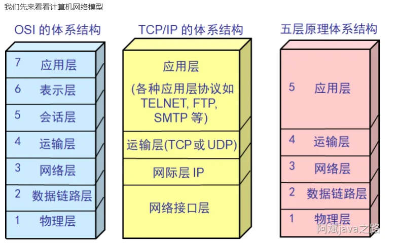

 # 八股文  

## IO网络模型
IO在系统层面上指的是数据从用户态到内核态的读写操做
从网络接收消息的步骤:
1用户空间向内核空间请求网络数据
2内核空间吧网卡数据读到 内核缓冲区
3将内核缓冲区的数据 复制到 用户缓冲区

常用3种I0模型:
- 阻塞 I0 ( BI0)-同步 :阻塞IO在请求内核数据的时候，没有数据就会一直阻塞直到获取数据
- 非阻塞 I0 (NIO)-异步:非阻塞IO在等待内核数据的时候，没有数据就会得到没数据的结果，应用可以进行其他动作。
- I0多路复用(I0 Multiplexing):IO在系统层面上指的是数据从用户态到内核态的读写操做，多路是指多个socket连接，复用是指一个或多个连接处理 ； IO多路复用可以同时监听多个IO事件

## BIO的优缺点
bio（ Blocking I/O）阻塞io:时效性高： 由于阻塞特性，有数据立马就返回，响应速度是最快的 ,但一直等待浪费cpu资源，每个链接需要一个独立线程，并发能力有限
## NIO的优缺点
nio（Non-blocking I/O）非阻塞io:NIO需要更少的线程来处理相同数量的连接，节省了系统资源,但是有无效轮询耗用资源，因此nio有了升级版IO多路复用。
## IO多路复用
IO多路复用解决了NIO的无效轮询的问题。可以说IO多路复用也是NIO，但是是NIO的高级用法。它的实现有三个非常重要的组件选择器（Selector）、缓冲区（Buffer） 和 通道（Channel）
通道（Channel）:是NIO中用于数据读写的双向通道,可以同时进行读写操作，传统的IO只能通过InputStream或OutputStream进行单向读写
                Java NIO中常见的Channel有：FileChannel（文件读写）、DatagramChannel（UDP协议）、SocketChannel（TCP协议）和ServerSocketChannel（监听TCP连接请求）等。
缓冲区（Buffer）:用于存储数据的缓冲区，可以理解为一个容器，可以从中读取数据，也可以将数据写入其中
                Java NIO中提供了多种类型的Buffer，例如ByteBuffer、CharBuffer、ShortBuffer、IntBuffer等
选择器（Selector）： Selector是NIO中用于监控多个Channel的选择器，可以实现单线程管理多个Channel。Selector可以检测多个Channel是否有事件发生，包括连接、接收、读取和写入等事件，并根据不同的事件类型进行相应处理。Selector可以有效地减少单线程管理多个Channel时的资源占用，提高程序的运行效率。  

## netty不用aio而是用io多路复用
Netty整体架构是Reactor模型,AIO有个缺点是接收数据需要预先分配缓存,对连接数量非常大且流量较小的情况会浪费内存.

### reactor模式:
Reactor 模式也叫做反应器设计模式，是基于事件驱动的模型，特别适合处理海量的I/O事件。广泛应用于网络框架，nginx，netty，redis。
- Reactor： 负责响应事件，将事件分发到绑定了对应事件的Handler,如果是连接事件，则分发到Acceptor。
- Handler： 事件处理器，负责执行对应事件对应的业务逻辑。
- Acceptor： 绑定了connect事件，当客户端发起connect请求时，Reactor会将accept事件分发给Acceptor处理。
 Reactor 模型中的 Reactor 可以是单个也可以是多个，Handler 同样可以是单线程也可以是多线程，所以组合的模式大致有如下三种：单 Reactor 单线程模型，单 Reactor 多线程模型和主从Reactor多线程模型。

 主从 Reactor 多线程模型的优点在于主线程和子线程分工明确，主线程只负责接收新连接，子线程负责完成后续的业务处理;该 Reactor模型适用于高并发场景，并且 Netty 网络通信框架也是采用这种实现

## bio，nio，aio分别试用什么样的场景？
bio适合连接数少的场景，使用起来最简单方便。比如小型网络交互
nio多路复用，适合连接数多，但是每个连接消息不多的场景（消息又多的话，相当于所有线程全速使用，会产生很大竞争），比如聊天室服务器。
aio适合连接数多，同时消息量也大的场景（预先分配缓存）。比如大数据的计算场景。

## select，poll，epoll的区别？
IO多路复用中的选择器（Selector）底层具体的实现依赖的就是操作系统的api，不同操作系统迭代出了select，poll，epoll等方案。
在linux中一切皆文件fd，socket连接也是一个fd
epoll网卡接收到数据时会回调 ,其他需要轮询

## 计算机网络

### **五层模型**

**●**应用层
为应用进程提供网络服务
**●**传输层(tcp,udp)
传输层将端到端的通信细化到进程到进程，并且保证了可靠通信。
**●**网络层 (数据报文+ip)
网络层将数据帧组装成`数据报文`，实现主机到主机直接，跨过多个节点的通信，但是不保证可靠性，顺序性
**●**链路层(数据帧)
链路层将物理层发出的很多bit收集起来，组装成一个`数据帧`。只提供相连网络节点间的数据传输。
**●**物理层(比特)
物理层只实现了每个`比特`一位一位的发放

由于OSI的体系更偏理论，没有考虑到实际的应用场景，我们现在都更遵循五层的网络模型体系

面向开发的程序员要关注:

●应用层
○HTTP,FTP,SMTP,DNS,CDN,TELNET,RPC
●传输层	
○TCP,UDP
●网络层
○IP

TCP的三次握手是怎样的？为什么不需要四次？两次行不行？
TCP的四次挥手是怎样的？
在浏览器输入URL按下回车，发生了哪些步骤？

三次握手四次挥手：
客户端：你在么
服务端：我在
客户端：好的，我知道了
开始传输数据

客户端：我要关闭链接了
服务端：等一下
服务端：可以了
客户端：拜拜
数据停止传输
#### 应用层

##### HTTP

##### FTP

文件传输协议

##### DNS

###### 

#### 传输层

传输层的协议有UDP和TCP，基本能解决99%以上的问题

#### 网络层

### 计算机网络构成

●节点
○主机及运行在上面的应用程序
○路由器（网络层）  ；  交换机（链路层）等网络设备
●边
○接入网链路：主机连接到互联网的链路
○主干网链路：路由器直接的链路
●协议
○tcp
○udp
○http
○等

### **数据通信，报文交换的方式？**

●分组交换（适用于互联网接入，共享网络）
○存储，转发
○排队时延
○满载丢包
●电路交换（适用于固定电话拨打，独占网络）
○频分复用
○时分复用
○波分复用

### **终端系统和边缘路由怎么接入？**

●住宅接入 modem（猫）借助以前的电话线路
●dsl（也是用电话线路，但是支持边打电话边上网）
●线缆网络（借助有线电视的线）

### DNS解析过程?

域名解析成具体的ip地址

1浏览器缓存(TTL有效期)

2host文件

3本地DNS解析器缓存(每个完整的内网通常都会配置本地DNS服务器)

4根DNS服务器 ： 返回给本地DNS域名服务器一个顶级DNS服务器地址

5顶级DNS服务器 如.com、.cn、.org

6权威域名服务器

7返回真实ip

### 浏览器一次url按下回车发生了什么**？

1进行DNS解析查找到服务器IP地址

2IP寻址找到服务器，并利用`三次握手建立TCP连接`
3浏览器生成HTTP报文，发送HTTP请求，等待服务器响应
4服务器处理请求，返回服务器
5根据HTTP是否开启长链接，进行TCP挥手
6浏览器根据静态资源进行页面渲染

###  **tcp和udp的差别？**

TCP面向连接，可靠，传输大量数据但速度慢

UDP面向非连接，不可靠传输少量数据 但速度快

