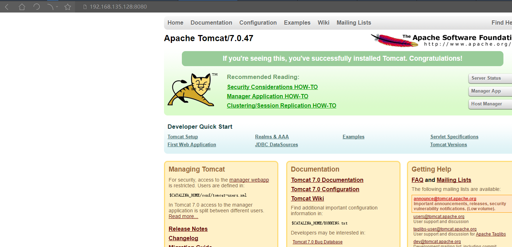

# Linux目录结构

{width="5.7659722222222225in"
height="3.0861111111111112in"}

# CentOS-6.5安装教程

## 开一个新的虚拟机

{width="5.754166666666666in"
height="3.035416666666667in"}{width="5.760416666666667in"
height="3.8048611111111112in"}{width="5.758333333333334in"
height="4.033333333333333in"}{width="5.7652777777777775in"
height="4.688888888888889in"}

## 安装操作系统\--镜像文件

{width="5.759027777777778in"
height="3.6506944444444445in"}{width="5.761805555555555in"
height="3.404861111111111in"}

## 启动虚拟机

{width="5.766666666666667in"
height="3.2125in"}

{width="4.608333333333333in"
height="3.158333333333333in"}

## 安装操作系统

{width="5.761111111111111in"
height="4.330555555555556in"}{width="5.764583333333333in"
height="4.347916666666666in"}{width="5.7652777777777775in"
height="4.202083333333333in"}{width="5.767361111111111in"
height="4.348611111111111in"}{width="5.7652777777777775in"
height="4.470138888888889in"}{width="5.767361111111111in"
height="4.272916666666666in"}{width="5.761805555555555in"
height="4.347916666666666in"}{width="5.764583333333333in"
height="4.374305555555556in"}

# **linux安装jdk**

## 需要linux版jdk

{width="2.5416666666666665in"
height="0.23333333333333334in"}

## **使用secureCRT连上linux服务器**

### 查看服务器ip（ifconfig）

{width="5.767361111111111in"
height="3.495138888888889in"}

### **cmd查看ping ip是否正常连接**

**如果不正常**

{width="5.758333333333334in"
height="2.801388888888889in"}

{width="5.7652777777777775in"
height="5.1875in"}

### **使用软件连接**

{width="5.756944444444445in"
height="3.495833333333333in"}

### **中文乱码解决**

{width="5.7659722222222225in"
height="3.9118055555555555in"}

## **切换到根目录，创建目录存放软件**

**cd /**

**mkdir soft**

## **安装依赖-防止报错**

Linux安装jdk后报错 -bash: /usr/local/java/jdk1.7.0_55/bin/java:
/lib/ld-linux.so.2: bad ELF interpreter

原因：

/lib/ld-linux.so.2 目录不存在

解决：

运行命令：yum install glibc.i686

## **将本地jdk软件包上传到linux系统中的soft目录**

{width="5.767361111111111in"
height="3.5229166666666667in"}{width="5.768055555555556in"
height="3.8694444444444445in"}

## **解压jdk压缩包**

**tar -zxvf jdk-7u55-linux-i586.tar.gz**

## **配置环境变量(在/etc/profile文件中)**

1vim /etc/profile

2.在文件尾部添加：

JAVA_HOME=/soft/jdk1.7.0_55

export PATH=\$JAVA_HOME/bin:\$PATH

{width="5.763194444444444in"
height="2.734722222222222in"}

3.重新加载一下文件： source /etc/profile 命令

4.查看jdk：java -version 命令

# **linux安装tomcat**

## 上传tomcat安装包

见jdk步骤

## **解压**

tar -zxvf apache-tomcat-7.0.47.tar.gz

## **启动tomcat**

进入bin目录

cd apache-tomcat-7.0.47/bin

启动startup.sh

./startup.sh

查看启动日志，看是否启动成功

进入logs目录打开catalina.out文件

## **关闭防火墙**

**service iptables stop**

## **在本地访问**

**linux ip地址:8080**

{width="5.768055555555556in"
height="2.78125in"}

# **linux安装mysql数据库**

## 安装

yum list mysql\*

yum install mysql\*

## **启动**

service mysqld start

## **进入mysql**

mysql -uroot

## **修改密码**

输入use mysql;

输入update user set password = password("root")where user='root'

## **退出mysql**

quit或者exit退出mysql

# **linux安装mysql数据库2\-\--MariaDB**

## 安装mariaDB数据命令

命令:

yum   install   mariadb-server

{width="5.761805555555555in"
height="3.1993055555555556in"}

## **MariaDB命令**

1.启动数据库命令 systemctl start mariadb

2.停止数据库命令 systemctl stop mariadb

3.重启数据库命令 systemctl restart mariadb

## **配置数据库**

命令:

mysql_secure_installation

{width="5.7652777777777775in"
height="2.9569444444444444in"}{width="5.766666666666667in"
height="2.0868055555555554in"}

## **设定远程访问**

{width="5.761805555555555in"
height="1.2506944444444446in"}{width="5.761805555555555in"
height="4.229166666666667in"}{width="5.767361111111111in"
height="4.826388888888889in"}{width="5.761111111111111in"
height="4.696527777777778in"}

## **设定开机启动**

systemctl  enable   mariadb

# **将项目发布到tomcat服务器**

## 在linux创建项目所用到的数据库和用户

数据库bos

用户gva gva

## 用数据库软件连接数据库

连接时注意关闭防火墙

service iptables stop

## **将本地数据库转移到linux数据库中**

{width="5.760416666666667in"
height="2.7125in"}

然后在linux数据库中导入sql

{width="5.766666666666667in"
height="2.763888888888889in"}

## **把本地项目打包成war包**

{width="5.7659722222222225in"
height="2.790277777777778in"}

## **将war包上传到tomcat webapp中**

{width="5.759722222222222in"
height="3.7868055555555555in"}

# **\*部署tomcat服务器集群**

{width="5.767361111111111in"
height="3.522222222222222in"}{width="5.7625in"
height="1.8881944444444445in"}

# **命令**

## 文件操作

**文件编辑**

vim 文件

按G到文件末尾，按gg到文件开头

然后按i进入插入模式

按esc退出插入模式

shift+zz保存文件

:q！不保存退出

:wq 保存退出

\-\-\-\-\-\-\-\-\-\-\-\-\-\-\-\-\-\-\-\-\-\-\-\-\-\-\-\-\-\-\-\-\-\-\-\-\-\-\-\-\-\-\-\-\-\-\--

vi的文本查找功能

按键 功能

/字符串 查找指定字符串

n 寻找下一个

N 回到前一个

？ 寻找上一个

/\^字符串 查找以字符串开始的行

/字符串\$ 查找以字符串结尾的行

/a.b 查找字符串a任意字符b

\-\-\-\-\-\-\-\-\-\-\-\-\-\-\-\-\-\-\-\-\-\-\-\-\-\-\-\-\-\-\-\-\-\-\-\-\-\-\-\-\-\-\-\-\-\-\--

**文件创建：** touch 文件名

**文件查看：** cat 文件 （只能看到内容的最后一屏）

more 文件 （可以翻页）（可以显示百分比）

q 退出查看

less 文件 （可以翻页）

tail -n 文件 （查看最后n行）

tail -f 文件 （动态监控）

**文件修改：** ① vim 文件 （命令模式）

② i （编辑模式 insert）

③ 按Esc （底行模式）

④ ：Nq （写入并退出）

⑤ ：q! （强制退出）

**文件拷贝**

cp 路径1 路径2

**文件命名**

mv 文件 新文件

**文件删除**

**rm 删除文件**

**文件查找**

**find / -name mysql.soc**

## **进程操作**

进程查看

ps -a(所有)u(详细状态)x(没有控制终端的)r(正在run)w(显示加宽)

ps -aux \| grep 过滤字段

杀死进程

kill -9 pid

杀死进程方式:

kill    PID1  PID2\.... 普通关闭进程

kill -15 PID\...            友好的关闭进程 进程可以善后

kill -9   PID\... 强制关闭进程  没有任何的提示

## 切换目录

cd / 切换到系统根目录

cd \~ 切换到主目录

cd或cd \~ 返回home目录

cd - 切换到上一个目录

cd - 目录名 返回指定目录

cd .. 返回上一级目录

cd ../.. 返回上两级目录

## 目录相关

**增加目录：**mkdir 目录 -p

p递归

**查看目录：ls**

Ls -a 显示所有（包含隐藏）

Ls - l 显示详细信息（缩写ll）

**寻找目录：**find 目录 -name '文件名' 根据文件名查找

**例如**：find / root -name 'test'

**修改目录(文件)名称:** mv 原名 新名

**移动目录（文件）位置（剪切）：** mv 原文件位置 目录新位置

**拷贝目录（复制）：** cp -r 目录名称 目录拷贝位置

（-r代表递归拷贝，拷贝文件不用带-r）

**删除目录：** rm -rf 目录文件

-r 递归

-f 强制

查找文件：find。

常用用法：

  -----------------------------------------------------------------------
  **命令**                  **含义**
  ------------------------- ---------------------------------------------
  find ./ -name test.sh     查找当前目录下所有名为test.sh的文件

  find ./ -name \'\*.sh\'   查找当前目录下所有后缀为.sh的文件

  find ./ -name             查找当前目录下所有以大写字母开头的文件
  \"\[A-Z\]\*\"             

  find /tmp -size 2M        查找在/tmp 目录下等于2M的文件

  find /tmp -size +2M       查找在/tmp 目录下大于2M的文件

  find /tmp -size -2M       查找在/tmp 目录下小于2M的文件

  find ./ -size +4k -size   查找当前目录下大于4k，小于5M的文件
  -5M                       

  find ./ -perm 777         查找当前目录下权限为 777 的文件或目录
  -----------------------------------------------------------------------

## 压缩文件命令

**打包：** tar -z(压缩)c(打包)(显示过程)f(指定文件名) 目标文件.tar.gz
文件夹

**解压：** tar -x(解压)vf 压缩文件 -c 路径 （解压到指定文件）

**解压：**tar -zxvf 文件名

解压后缀为.tar.gz文件

tar -zxvf 文件名

-z(指定压缩包的格式为：file.tar.gz)

-x代表解开

-v显示进度

-f指定文件名,放最后

## 其他命令

**⒈ Pwd** 显示当前位置

**⒉ grep** 搜索文件内容

grep to 文件 ------ color （在文件中搜索）

**⒊ 管道命令：**将前一个命令的输出作为本次目录的输入

表层进程 → **例如**: Ps -ef \| grep 关键字

**⒋显示进程信息** **Ps**

Ps -a（显示当前用户所有进程）

Ps -aux（显示所有用户 及 终端所有进程）

ps -aux\| grep 名 过滤进程

**⒌杀死进程** **kill**

kill ---信号值（q为绝对终止） pid

**⒍网络通信命令**

**查看系统当前网卡信息：**if config

**查看与某台机器连接情况：**ping ip地址

**⒎查看当前当口调用**

Netstat -aov

## Linux权限命令

**权限** drwx rwx r\--
（d代表目录，第一个rwx代表主权限，第二个rwx代表组权限，r\--属于其他用户权限，-代表操作权限，r可读，w可写，x可执行）

**注**：d是目录，-是文件。

更改权限命令

chmod u=rwx,g=rwx,o=r文件

（**注**：u代表主用户，g代表组用户，o代表其他用户）

chmod -R 777 ./soft/    递归修改权限，常用，777 表示所有用户（所有者、组和其他人）都有读、写和执行权限。

## 远程工具控制Linux

使用SSHSecure软件

## **防火墙相关**

如果没有service命令，先安装

1，安装systemctl：

yum install iptables-services

2，设置开机启动：

systemctl enable iptables

systemctl enable iptables.service

systemctl start iptables

=============================

1:查看防火状态

**systemctl status firewalld**

service iptables status

2:暂时关闭防火墙

**systemctl stop firewalld**

service iptables stop

3:永久关闭防火墙

**systemctl disable firewalld**

**chkconfig iptables off**

4:重启防火墙

systemctl enable firewalld

service iptables restart

5:永久关闭后重启

//暂时还没有试过

chkconfig iptables on

## **防火墙相关-firewall**

### **查看防火墙状态firewall-cmd \--state**

### 启动防火墙systemctl start firewalld.service

### **永久启动防火墙systemctl enable firewalld.service**

### **关闭防火墙systemctl stop firewalld.service**

### **永久关闭防火墙systemctl disable firewalld.service（针对下次有效）**

### **查看开放的端口**\|firewall-cmd \--list-ports

### **开启端口**\|firewall-cmd \--zone=public \--add-port=端口/tcp \--permanent

--zone *#作用域* --add-port=80/tcp *#添加端口，格式为：端口/通讯协议*
--permanent *#永久生效，没有此参数重启后失效*

### **开启范围端口 8080 - 9090范围的端口**\|firewall-cmd \--zone=public \--add-port=8080-9090/tcp \--permanent

### **开启端口后重启防火墙\|firewall-cmd \--reload**

## **端口相关**

1.列出所有端口：

netstat -ntlp

 

2.查看端口占用情况命令，比如查看8080端口的详情：

lsof -i tcp:8080

 

3.检查端口号被哪个进程占用，比如查看端口号8080：

netstat -lnp\|grep 8080

 

4.查看进程的详细信息，比如端口号8080对应的进程为12345：

ps 12345

 

5.杀死进程，比如进程为12345：

kill -9 12345

 

6.查看防火墙对外开放端口的命令：

iptables-save

 

7.增加对外开放的端口，比如8080：

firewall-cmd \--zone=public \--add-port=8080/tcp \--permanent     
 //添加端口

firewall-cmd \--reload                                                 
               //重载防火墙

 

8.关闭对外开放的端口，比如8080：

firewall-cmd \--zone=public \--remove-port=8080/tcp \--permanent 
//关闭端口

firewall-cmd \--reload                                                 
   

## **安装卸载相关**

查包名：rpm -qa\|grep -i mysql

删除命令：rpm -e --nodeps 包名

//yum安装方式下载

1.查看已安装的mysql

命令：rpm -qa \| grep -i mysql

2.卸载mysql

命令：yum remove mysql-community-server-5.6.36-2.el7.x86_64

查看mysql的其它依赖：rpm -qa \| grep -i mysql

//卸载依赖

yum remove mysql-libs

yum remove mysql-server

yum remove perl-DBD-MySQL

yum remove mysql

## **关机重启**

shutdown -r now

重启

shutdown -h now

#现在关机

shutdown -h 05:30

#指定时间关机

# 远程工具连接linux

## 解决ifconfig -a 无法使用的问题

需要进入

{width="5.2in"
height="0.20833333333333334in"}

编辑ifcfg-ens33,修改ONBOOT=yes

{width="3.658333333333333in"
height="0.2833333333333333in"}

{width="3.0166666666666666in"
height="2.6083333333333334in"}

重启网络服务，执行：

{width="1.9083333333333334in"
height="0.225in"}

安装net-tools

{width="1.5666666666666667in"
height="0.2in"}

## 远程连接

# **服务器之间的分发**

scp -r /usr/local/jdk1.7.0_45/ 192.168.32.140:/usr/local/s

# 常见问题

## ifconfig无法使用

yum install net-tools -y安装

# 修改主机名

vi /etc/hosts

{width="3.558333333333333in"
height="2.325in"}

重启

reboot -f
